# 1.了解三式

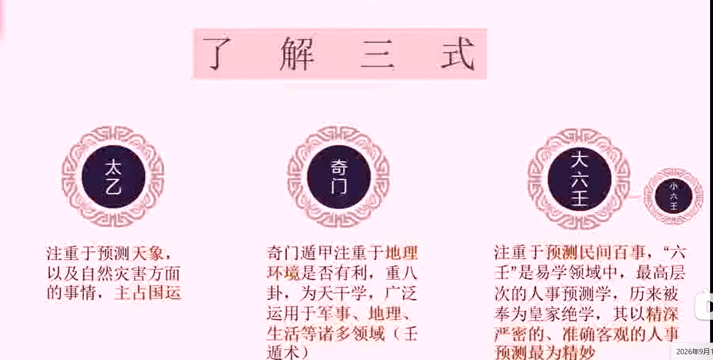

## 奇门重天干，地支在盘上计划看不见。而六壬重地支。六壬的诞生是早于奇门的，所以有很多东西都被奇门借鉴过来了。

# 2.奇门遁甲是什么

奇门遁甲是中国古代的一门最高层次的**术数预测**和**时空运筹**学问。

核心定义

- **三式之首**：它与太乙神数、大六壬并称为中国古代神秘学中的“三式”，且被尊为三式之首，民间常有“学会奇门遁，来人不用问”的美誉。
- **时空模型**：它将天体运行、节气历法、阴阳五行、河图洛书及九宫八卦融为一体，把特定时间和空间抽象成一个动态的“盘式”，用来推演事物的发展规律。

名称来源

- **奇**：指三奇，即天干中的**乙、丙、丁**。
- **门**：指八门，即休门、生门、伤门、杜门、景门、死门、惊门、开门。
- **遁甲**：指六仪（戊、己、庚、辛、壬、癸）中的“甲”木藏于六仪之下不显露。 

基本结构（四盘）

奇门遁甲排盘由四个同心圆般的盘面组成：

1. **天盘**：代表九星（天蓬、天芮、天冲、天辅、天禽、天心、天柱、天任、天英）。

2. **地盘**：代表九宫八卦（乾、坎、艮、震、巽、离、坤、兑）与六仪三奇。

3. **人盘**：代表八门（反映人间吉凶与行为方向）。休门、生门、伤门、杜门、景门、死门、惊门、开门。

4. **神盘**：代表八神（值符、腾蛇、太阴、六合、白虎/勾陈、玄武/朱雀、九地、九天）。 

   八神详解与象征意义

   - **值符**（天乙之神，大吉）
     - **性质**：八神之首，五行属土，百恶消散。
     - **象意**：代表领导、贵人、名人、高档精品、银行或单位里的核心负责人。 
   - **螣蛇**（虚诈之神，中平或带凶）
     - **性质**：五行属火，主虚伪、惊恐。
     - **象意**：代表多变、波折、怪异事件、虚假不实、缠绵难缠的疾病或官司。 
   - **太阴**（荫护之神，吉）
     - **性质**：五行属阴金，主阴匿暗昧。
     - **象意**：代表密谋策划、隐蔽藏匿、暗中帮助、细致周密，也可能隐喻阴险、私情。 
   - **六合**（护卫之神，大吉）
     - **性质**：主平和、合作。
     - **象意**：代表婚姻、恋爱、合同契约、中介交易、谈判合作及人际关系。 
   - **白虎**（凶煞之神，大凶）
     - **性质**：五行属金，主刚猛、血光。
     - **象意**：代表行兵打仗、打斗争讼、严重疾病、车祸伤灾、警察或刚强威猛之人（下方隐伏勾陈）。 
   - **玄武**（盗贼之神，凶）
     - **性质**：主暗昧、欺诈。
     - **象意**：代表偷盗、走失、口舌是非、阴谋诡计、迷糊不清或玄学灵异之事（下方隐伏朱雀）。 
   - **九地**（坚牢之神，吉）
     - **性质**：具有坤土性质，主柔顺、安静、厚载。
     - **象意**：代表低矮、坚固、缓慢、隐忍、持久、蓄积力量，利于防守、藏匿或农业种植。 
   - **九天**（威悍之神，大吉）
     - **性质**：具有乾金性质，主刚强、高大、主动。
     - **象意**：代表高远、飞机、天空、出国、主动出击、威严声势、发展迅速。

九遁

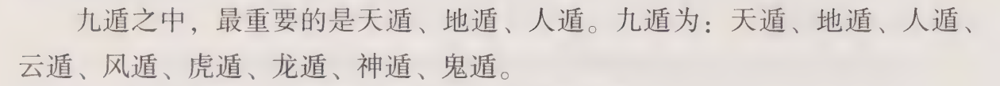

主要用途

- **古代军事**：最初用于排兵布阵、行军打仗、选择天时地利与作战方向。

- **现代预测与决策**：在现代常被用于商业竞争、投资决策、求职谋划及日常生活中的趋势分析。

  

### 甲是天干之首，在军事中就是代表元帅，在行军打仗中，需要把主帅隐藏起来，以免别人生擒导致打仗失败。使用在奇门遁甲排盘甲是不可见的。 

# 3.奇门遁甲的起源

传说起源

- **九天玄女授书**：相传黄帝与蚩尤在涿鹿大战时，蚩尤凶猛异常、制造迷雾，黄帝屡战不胜。九天玄女下凡将《奇门遁甲》之术传授给黄帝。
- **风后整理**：黄帝得到天书后，命令大臣风后将其整理成四千三百二十局（后简化为一千零八十局），并以此击败了蚩尤。

历史发展与演变

- **姜太公精简**：到了周朝，姜子牙（姜太公）将奇门遁甲精简为七十二局。
- **张良再精简**：汉代留侯张良精简并将其定为阴遁九局、阳遁九局，共十八局，成为后世流传的主要基础。
- **后世融入**：历代军事家和术数大家（如诸葛亮、刘伯温等）不断对其进行丰富，融合了河图洛书、易经八卦、天文历法等学问
### 奇门和24节气的关系

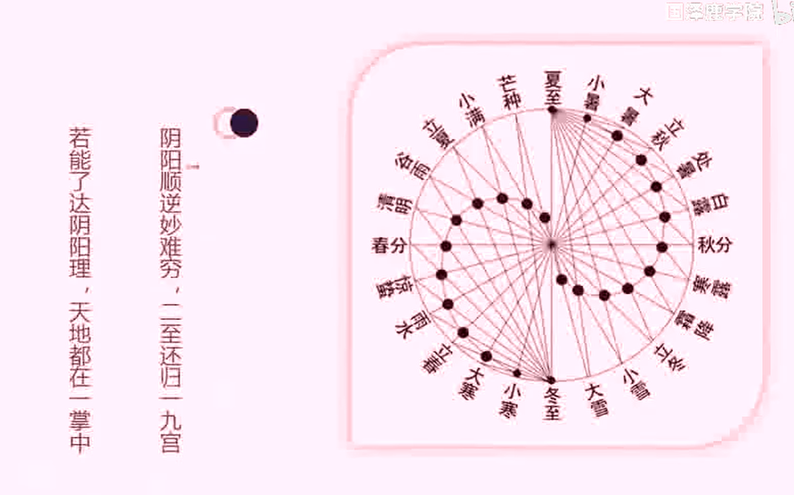

# 4.奇门遁甲的相关书籍

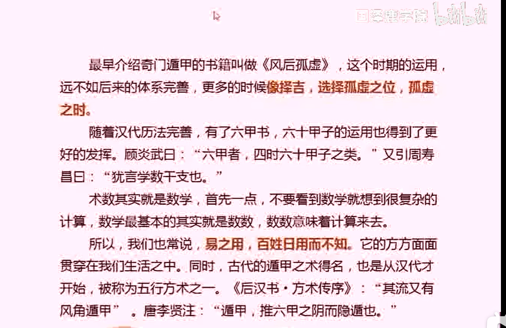

## 奇门遁甲是和星象相关的。它的精髓就是天人合一。

# 5.遁甲万一诀

《遁甲万一诀》是一卷中国古代奇门遁甲与兵占类的术数古籍。 

基本概况

- **作者与归属**：书题常署为唐代名将李靖所纂、黄帝所传之书。
- **收录记载**：见于《郡斋读书志》、《文献通考·经籍考》等古代书目。
- **核心内容**：主要以休、生、伤、杜、景、死、惊、开八门，来推断国家与军事行动的吉凶祸福。

### 传说李靖打仗百战百胜，就是应用《遁甲万一诀》里面的方法获胜的，只可惜者本书已经失传了。

# 6.壬遁之源

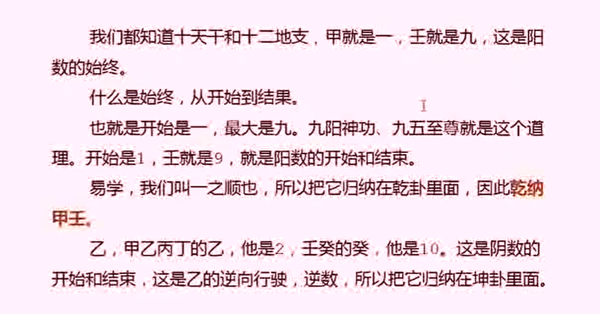

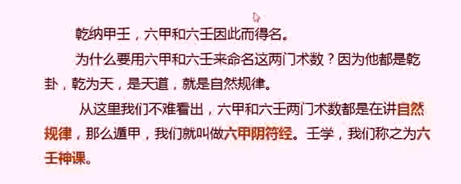

# 7.六甲阴符经

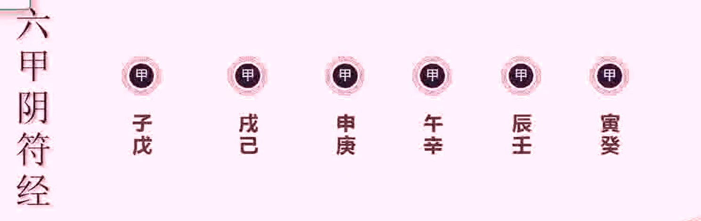

## 甲子藏在戊里面，甲戌藏在己里面，甲申藏在庚里面，甲午藏在辛里面，甲辰藏在壬里面，甲寅藏在癸里面

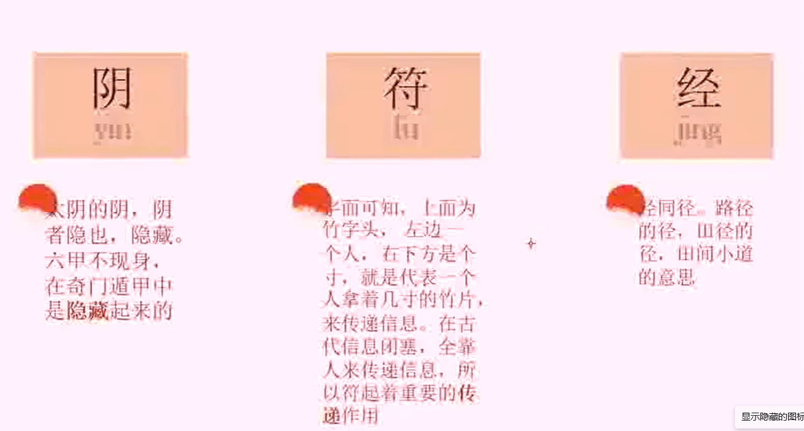

# 8.直符直使

直符与直使是传统奇门遁甲预测中最重要的两个核心概念，代表特定时辰当值的统帅与先锋。

什么是直符

- **定义**：直符（又称值符）是特定时辰中当值的**九星**（天蓬、天芮、天冲等）。
- **来源**：它由当前时辰所在的旬首（甲子、甲戌等）决定。旬首落在哪一个宫位，该宫的九星就是当值的直符。
- **作用**：直符代表总指挥或大统帅，主“令”。它定方向、定策略，也代表事情的核心意图与主要矛盾。

什么是直使

- **定义**：直使（又称值使）是特定时辰中当值的**八门**（休门、生门、伤门等）。
- **来源**：它同样由旬首决定，是旬首本宫所对应的八门。
- **作用**：直使代表执行官或先锋，主“行”。它负责落地执行、打通路径，并处理具体的事务和细节。

两者的关系

- **统帅与先锋**：直符如同统帅负责运筹帷幄，直使如同先锋负责冲锋陷阵。
- **动静配合**：预测时，看直符能知晓事情的总体背景和求测者的心意，看直使则能了解事情的发展过程和最终落脚点

# 9.遁甲之源

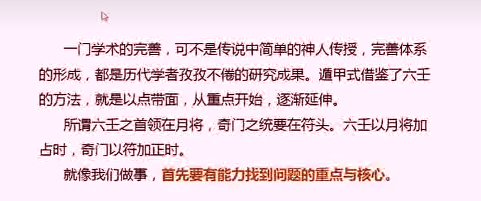

## 学习奇门遁甲就是要学会排盘，非常重要。

# 10.解决生活中的问题

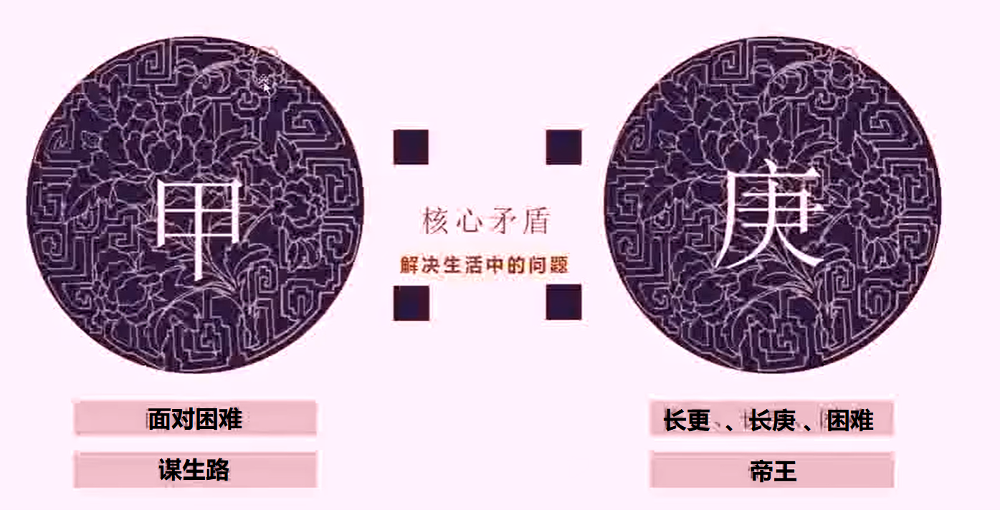

# 11.六仪代表了什么

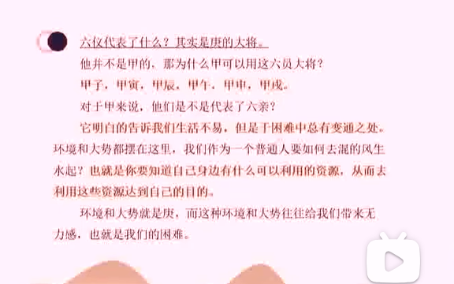

# 12.如何翻身

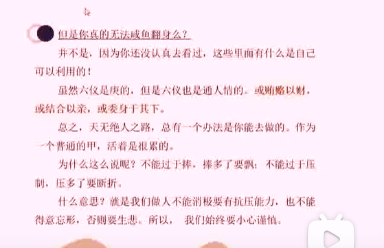

# 13.三奇是什么意思

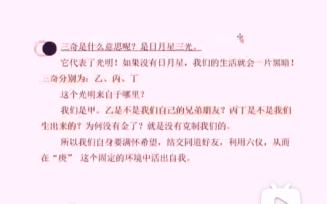

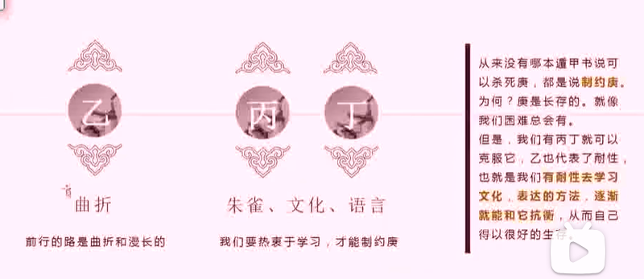

# 14.什么是遁？

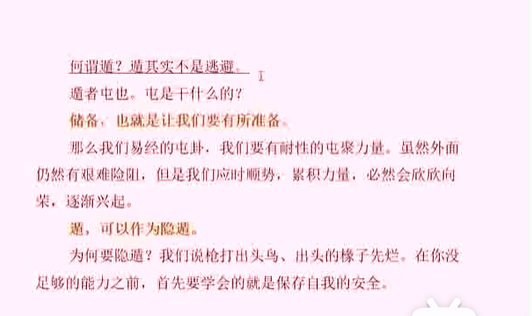

# 15.为什么又叫奇门？

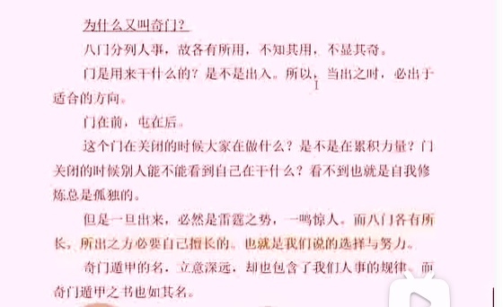