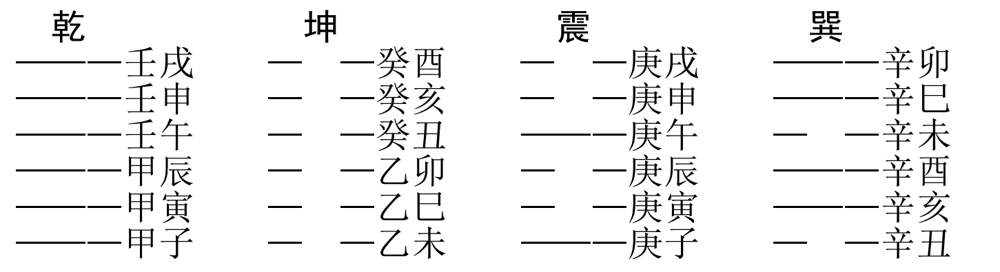
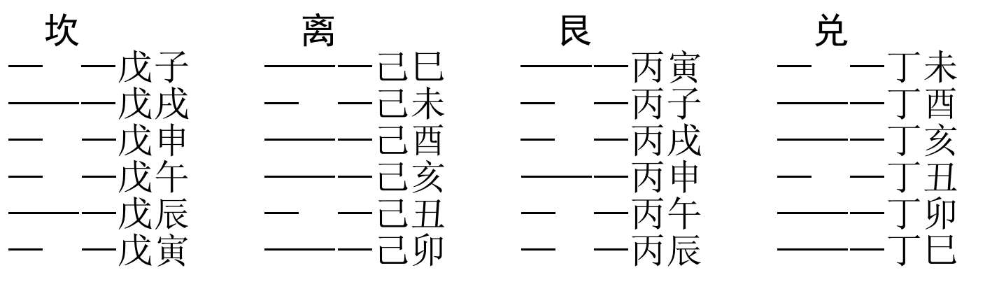
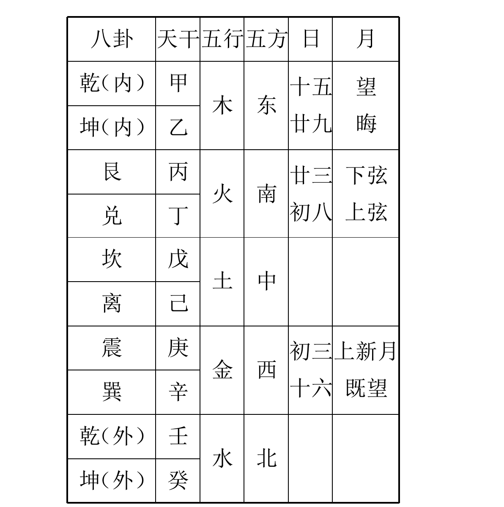
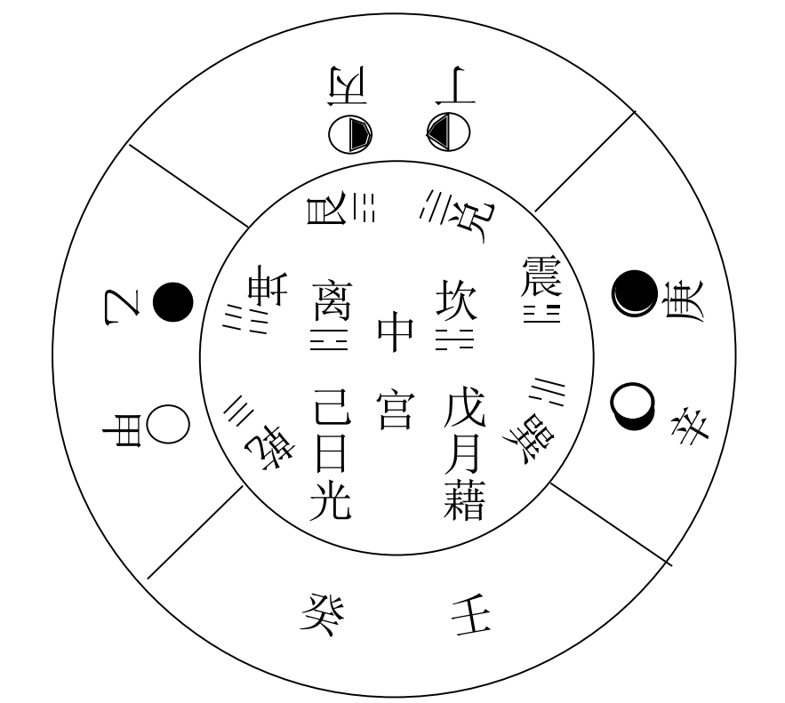
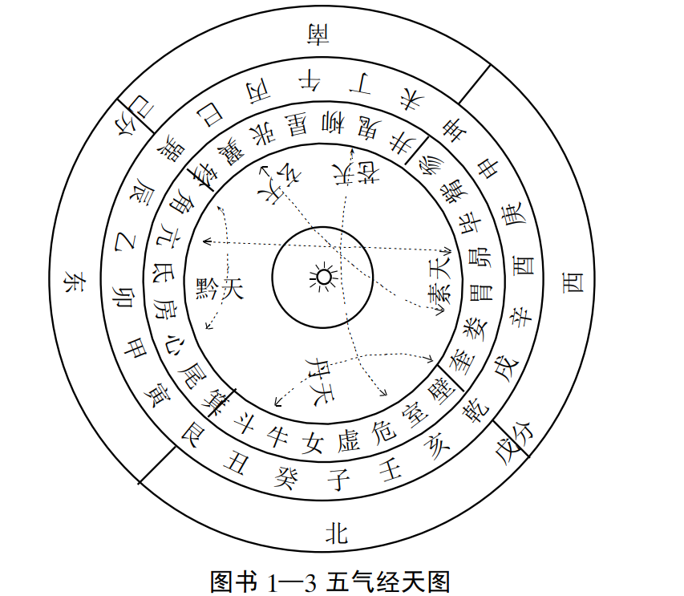

# 第二章 干支数理基础知识  

干支--》天干和地址，是祖国传统文化体系中， 一个极具特
殊地位和意义的历史文化现象  .可以把干支看作是标志一切事物物质、 能量、 信息变化及其转化关系的全息性、干支数理基础知识 、综合性信息代码。  

## 1.干支的起源和含义  

“ 干支”， 即十天干“ 甲、 乙、 丙、 丁、 戊、 己、 庚、 辛、 壬、 癸”， 和
十二地支“ 子、 丑、 寅、 卯、 辰、 巳、 午、 未、 申、 酉、 戌、 亥”的统称。  

### 文字学音韵六书对十天干的具体解释分别是：  

“ 甲”就是铠甲， 指万物冲破其甲而突出的意思和阶段。
“ 乙”为“ 轧”字， 象草木“ 冤曲而出， 阴气尚强， 其出乙乙”的意思和时候。
“ 丙”为“ 炳”字， 指万物“ 炳然茂盛， 但“ 阴气动气， 阳气将亏”的意思和时候。  

“ 丁”为“ 壮”字， 指万物丁实、 壮丁。
“ 戊”为“ 茂”字， 象征万物繁茂的阶段及其特性。
“ 己”为“ 起”字， 象征万物奋然而起的阶段和特性。
“ 庚”为“ 更”字， 象秋时万物“ 庚庚有实”， 后更新之意。

  “ 辛”为“ 新”字， 指万物彻底成熟一新的意思和时候。
“ 壬”为“ 任”或“ 妊”字， 象气往北方， 阴极阳生， 万物被天地孕育， 如人怀妊之象。
“ 癸”为“ 揆”字， 象冬时水土平， 水从四方汇流土中， 催动万物萌生的阶段和意义  

### 文字学音韵六书对十二地支的解释分别是 ：

“ 子”即“ 滋”或“ 孽”字， 指十一月阳气动， 万物滋生繁育的阶段和意义。
“ 丑”即“ 纽”字， 蜷曲像手五形， 指十二月万物萌生、 纽芽。
“ 寅”即“ 虫寅”或“ 演”字， 指正月阳气动， 万物生长的时候和意义。
“ 卯”即“ 冒”或“ 茂”字， 象二月万物冒地而出。
“ 辰”即“ 伸”或“ 震”字， 象三月阳气动， 雷电振， 万物伸长的阶段和意义。  

“ 巳”即“ 已”字， 指四月阳已尽， 阴气已现， 万物已成的时候和意义。
“ 午”即“ 仵”字， 是说万物已过极盛之时， 又是阴阳相交的时候。
“ 未”即“ 味”字， 象六月万物长成， 具有滋味。
“ 申”即“ 身”字， 指七月万物粗具成体的阶段和意义。  

酉”即“ 老”或“ 鲍”或“ 纟酉”字， 象征万物十分成熟的阶段和特性。
“ 戌”即“ 灭”或“ 毕”字， 代表九月阳气微， 万物毕成归土的时候和意义。
“ 亥”即“ 核”或“ 艹 亥”字， 指十月微阳接盛阴， 万物收藏成种子的时候和意义。  

这些含义，刚开始是指植物的“ 生、 长、 化、 收、 藏”等各个不同发展阶段的主要特点和次第  

后来被泛化，指代一切事物发展变化的不同阶段，及其各自盛衰往复变化的规律和特点  

## 2.一些有关干支确立的背景和观点  

干支  它是中国古人“ 天人合一”思想的一个集中表现。  

### 一、 易学、 中医学、 人体科学对干支的研究解释  

#### （ 一）干支配八卦  

 形成了易学重要的卦气纳甲、 纳子学说  

八卦与干支配应的具体情况如下  

##### (二)魏伯阳《周易参同契》纳甲、 月体纳甲说  

“ 纳甲”  组配
分别是： 甲乾乙坤， 相得合木， 故甲乙在东； 丙艮丁兑， 相得合火，故丙丁在南； 戊坎己离， 相和合土， 故戊己居中； 庚震辛巽， 相得合金， 故庚辛在西； 天壬地癸， 相得合水， 故壬癸在北  ，如下图

月体纳甲”， 即把月亮盈亏， 阴阳消长的过程与八卦、干支等密切联系起来。 “ 夏历初三， 月光始生， 由西方升起， 一阳
初生， 象震纳庚； 初八， 月光生出一半， 又增一阳， 象兑纳丁； 十五日， 月光盛满， 为望月， 居东方， 阳极象乾纳甲； 十六日， 月光始亏， 月初生魄， 象巽纳辛； 二十三日， 月亏一半， 即月下弦之时， 位  南方， 更增一阴， 象艮纳丙； 二十九日、 三十日， 月光消失为晦， 居东方， 阴之极， 象坤纳乙； 离为火， 象日纳己； 坎为水， 象月纳戊”。
见图示  

##### （三）干支与人体脏腑经络气血运行  

人体脏腑经络气血流注亦有着一定的时间序列关系和时间周期  其与天干、 地支日期时间的变化有着极
为密切的联系  

1. ###### 天干与脏腑经络气血运行  

   中医学 脏腑、 经络气血运行与日天干变化的关系  口诀：  

   甲胆乙肝丙小肠， 丁心戊胃己脾乡；
   庚属大肠辛属肺， 壬属膀胱癸属肾；  

   三焦阳腑须归丙， 包络从阴丁火旁；
   阳干宜纳阳之腑， 脏配阴干理自当。  

   中医创造了独具特色的中医时间疗法  

   如《内经》说“ 肝病者， 起于甲乙， 愈在丙丁， 加于庚辛， 庚辛不死， 持于壬癸……   “ 

###### 2、 十二支与气血流注  

人体气血流注变化节律和十二支辰的变化是同步和相应的。 每天人的气血流注顺序是， 寅时流注肺经，卯时流注大肠经， 辰时流注胃经……丑时流注肝经  ，亦有歌诀一首  

肺寅大卯胃辰宫， 脾巳心午小未中，
申膀酉肾心包戌， 亥焦子胆丑肝通。  

应用举例：如肺经疾患， 实证， 可在肺经、 肺气方盛的寅时， 针泻肺经子穴尺泽， 因肺属金， 金能生水， 尺泽为肺经合水穴， 亦本经子穴， 故肺经实证应泻尺泽。 而肺经虚证， 则可在肺经流注时辰刚过， 肺气方衰的卯时， 针补肺经母穴太渊， 因肺属金， 土能生金，
太渊为肺经俞土穴， 为肺经母穴， 是故肺经虚证应补太渊。  

### 二、古天文、 气象学对干支的一些解释  

#### 1、 运气学说中年干确定与天文气象变化关系  

《黄帝内经》说： 祖先  注意到每年运行于天穹之中， 分别有五种不同的云气， 即红、 黄、青、 白、 黑五色云气， 且分应火、 土、 木、 金、 水五行类属。 后来他们便把苍穹划分为二十八宿所主之不同区域， 把地平亦划为二十四个不同方位， 且有着一定的对应关系。 做出如下一些规定和说明。   

①当丹天之气（ 红色云气）横亘于牛女和奎壁四宿之间时：此刻四宿在地平方位对应戊、 癸， 是为火运年份， 其年年干
非戊即癸。
②"当黔天之气（ 黄色云气）横亘于心尾与角轸四宿之间时：此时四宿在地平方位对应甲、 己， 是为土运年份， 其年年干
为甲或己。  

③当苍天之气（ 青色云气）横亘于危室和柳鬼四宿之间时：此时四宿在地平方位对应丁壬， 是为木运年份， 其年年干为
丁、 壬。
④当素天之气（ 白色云气）横亘于亢氐与昴毕四宿之间时：此刻四宿在地平方位对应乙、 庚， 是为金运年份， 其年年干
为乙、 庚  

⑤当玄天之气（ 黑色云气）横亘于张翼和娄胃四宿之间时：此刻四宿在地平方位对应于丙辛， 是为水运年份， 其年年干
为丙、 辛。  

page27