# 1.洛书九宫

## 1》洛书九宫排列规则

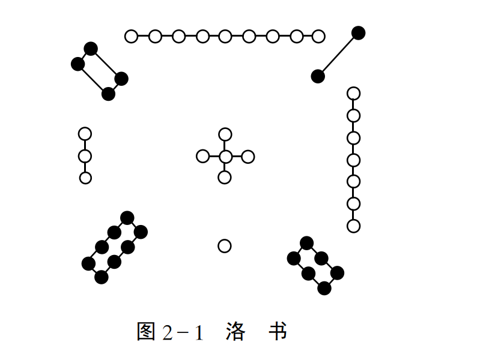

上图特点：每一条直线(横，竖，斜)之和都是15

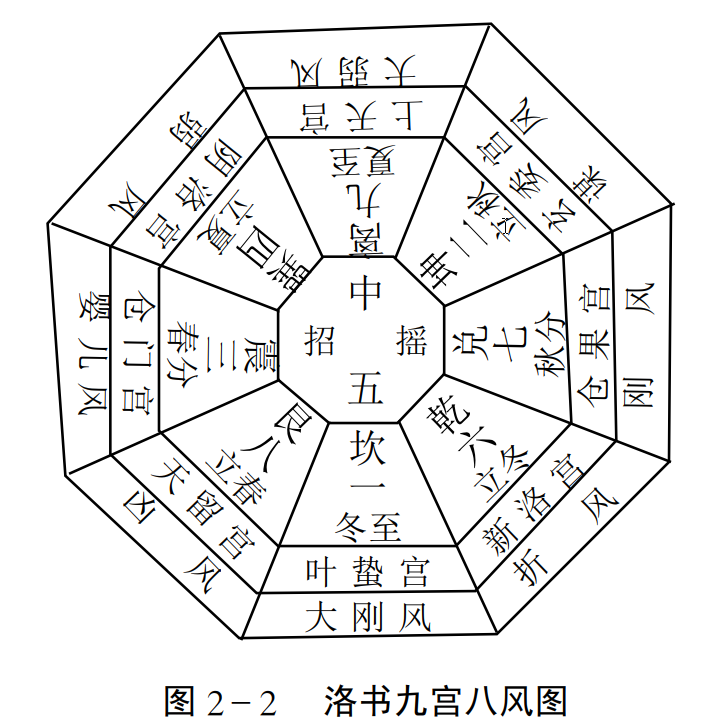

《系辞》说“ 洛书概取龟象， 故其数戴九履一， 左三右七， 二四
为肩， 六八为足”， 具体有以下几个特点。
（ 一）阳正阴隅。 一、 三、 七、 九为阳， 分居北、 东、 西、 南四正
方位， 二、 四、 六、 八为阴， 分居西南、 东南、 西北、 东北四隅之地，
五居中央。
（ 二）阴阳分离。 阴阳独立各居， 彼此互不相抱， 生成单处，
自有形体。
（ 三）有始无终。 自一至九， 其十不备， 是以生机不已， 动息
不停。  

四）阳君阴臣。 奇为正， 偶为侧， 君居正而臣居侧， 四正之
阳统四隅之阴。
（ 五）阴阳均衡。 纵行、 横行、 对角线三自然数之和均为十  五， 是谓常数， 以象阴平阳秘， 阴阳均衡。   （见上图）

### 对于八风图2-2的解释注意，这里的八风（实风，也叫天之八风）和下面的八风是不一样的。

坎宫， 叶蛰之宫， 主冬至、 大寒、 小寒三节， 为大刚风。 损伤人体， 内舍于肾， 外在于骨及肩背， 其病为寒。
艮宫， 天留之宫， 主立春、 雨水、 惊蜇三节， 为凶风。 损伤人体， 内舍肠胃， 外在两胁、 脚节。
震宫， 仓门之宫， 主春分、 清明、 谷雨三节， 为婴儿风， 损伤人体， 内舍于肝， 外在筋纽， 其病主湿。
巽宫， 阴洛之宫， 主立夏、 小满、 芒种三节气， 风从东南方来，为弱风， 损伤人体， 内舍于胃， 外在肌肉， 其病气主体重。
离宫， 上天之宫， 主夏至、 小暑、 大暑三节， 风从南方来， 为大弱风， 损伤人体， 内舍于心， 外在于脉， 其病为热  

坤宫， 玄委之宫， 主立秋、 处暑、 白露三节， 风从西南方来， 为谋风， 损伤人体， 内舍于脾， 外在于肌肉， 其病衰弱。
兑宫， 仓果之宫， 主秋分、 寒露、 霜降三节， 风从西方来， 为刚风， 损伤人体， 内舍于肺， 外在皮肤， 其病为燥。
乾宫， 新洛之宫， 主立冬、 小雪、 大雪三节， 风从西北来， 为折风， 损伤人体， 内舍小肠， 外在于手太阳脉， 其病主暴死。  

## 2》 洛书九宫配九星、 八卦、 八门  

奇门遁甲中， 将洛书九宫分配九星、 八卦、 八门， 形成了奇门
象数理模型的地盘基本框架结构， 具体如图所示。   

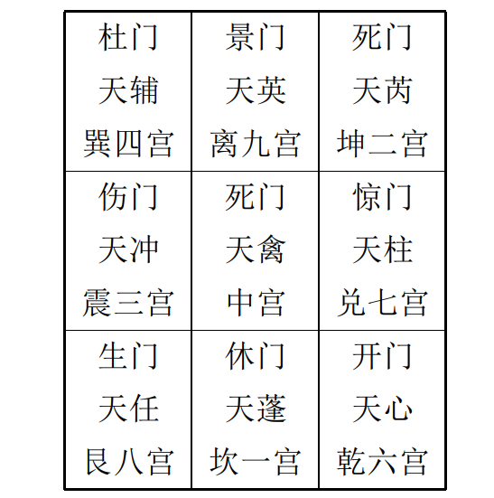

## 3》、 洛书九宫配八风（虚风，也叫病之八风）、 十二律、 十二辰、 二十八宿  

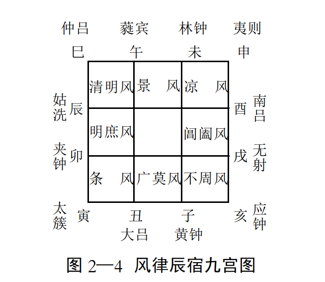

**广莫风**， 居北方坎一宫， 主寒气广远来自沙漠， 阳气在下。时主十一月， 建子， 律应黄钟， 星宿为虚女。
**条风**， 居东北艮八宫， 主天地融冻， 万物开始逐渐生发条达。时主十二月、 正月， 月建丑寅， 律应大吕， 太簇， 星主牛斗箕房。
**明庶风**， 居东方震三宫， 主阳气上升， 万物明出茂盛。 时主二月， 建卯， 律配夹钟， 星主氐、 亢、 角。
**清明风**， 居东南巽四宫， 主天气明净清朗。 时主辰、 巳二月，律配姑洗、 仲吕， 星主轸、 星、 张。
**景风**， 居南方离九宫， 主万物高大茂盛， 阳气已终， 律配蕤宾， 时值午月， 星应柳、 井。
**凉风**， 居西南坤宫， 主风夺万物之气， 衰老进入收成之期， 时值未申二月， 律配林钟、 夷则， 宿应参、 毕。  

**阊阖风**， 居西方兑宫， 主万物成而收藏之， 时为酉月， 律配南吕， 宿应昴、 胃。
**不周风**， 居西北乾宫， 主阴气盛极之时， 配戌亥二月， 律应无 射， 应钟， 宿配娄奎  

## 4》洛书九宫与古代星空地域分野  

### 分野是什么？

中国古代天文学将天上某一星区同地上某一地区对应起来， 并按一定的规则把它们划分为若干不同区域， 而后通过观测
天象变化， 来分析预测地面人事变化的吉凶祸福， 这就叫作分野。  

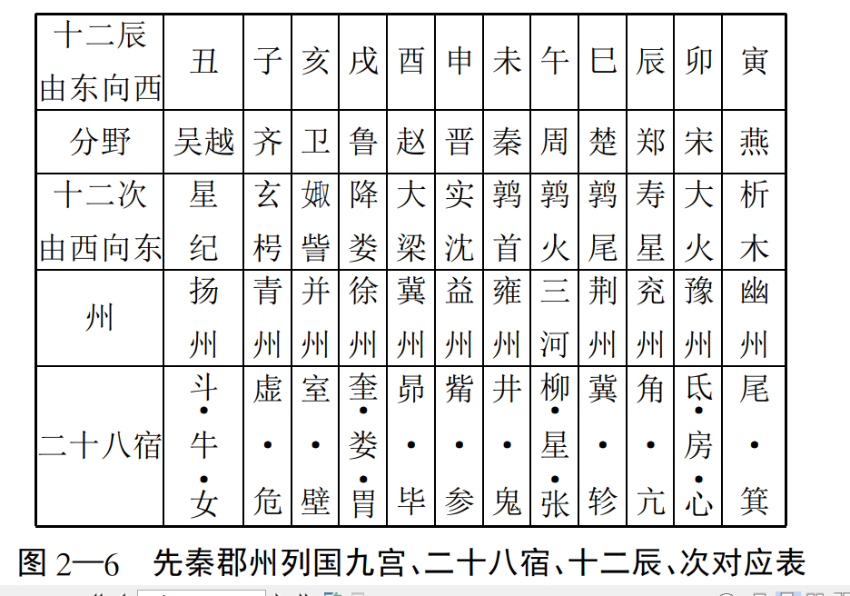

## 5》洛书九宫与奇经八脉相配  

洛书九宫与奇经八脉的相配关系，在传统中医针灸学中主要通过**灵龟八法**（又称奇经纳卦法）来体现，即将洛书九宫的数字与八脉交会穴及八卦方位进行对应。 [[1](http://swmac-app.blogspot.com/2011/04/blog-post_23.html), [2](https://www.epochtimes.com/gb/6/10/22/n1495223.htm)]

洛书九宫与八脉交会穴的对应关系

根据古典针灸歌诀（如《针灸大成》中的八法歌），洛书九宫之数与八卦、奇经八脉交会穴的配合如下： [[1](http://swmac-app.blogspot.com/2011/04/blog-post_23.html)]

- **坎一**：对应 **申脉**（通于**阳跷脉**，属足太阳膀胱经）
- **坤二 / 坤五**：对应 **照海**（通于**阴跷脉**，属足少阴肾经）
- **震三**：对应 **外关**（通于**阳维脉**，属手少阳三焦经）
- **巽四**：对应 **足临泣**（通于**带脉**，属足少阳胆经）
- **乾六**：对应 **公孙**（通于**冲脉**，属足太阴脾经）
- **兑七**：对应 **内关**（通于**阴维脉**，属手厥阴心包经）
- **艮八**：对应 **后溪**（通于**督脉**，属手太阳小肠经）
- **离九**：对应 **列缺**（通于**任脉**，属手太阴肺经）
- *（中央 **五** 寄于坤土，合而为用）*

核心应用：灵龟八法

- **原理**：将人体奇经八脉相交会的八个特定腧穴，按照洛书九宫的数理时空规律，依据每日、每时的天干地支进行运算推导。
- **配穴规律**：八脉交会穴在九宫中阴阳相配、表里呼应，分为四组（如公孙配内关、后溪配申脉等），用以调理人体气血阴阳、疏通经络。

## 6》洛书与阴阳寒热比数  

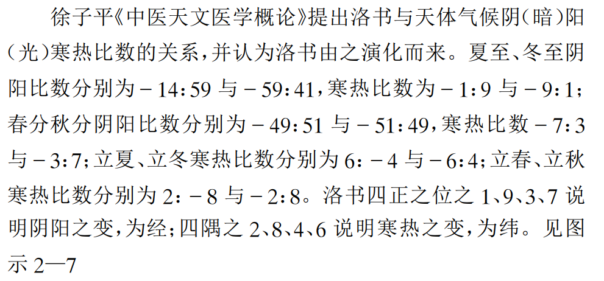

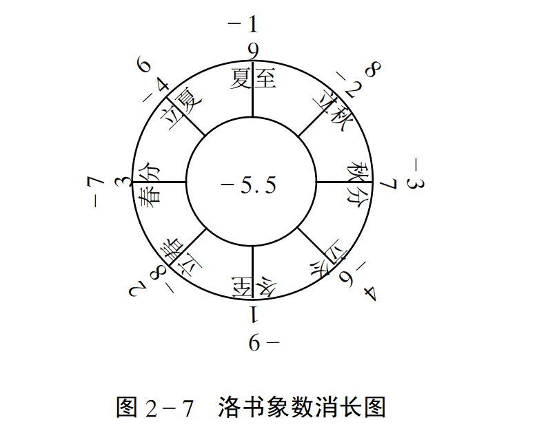

## 7》洛书九宫与现代数学  

### （ 一）洛书矩阵

洛书矩阵即是洛书和矩阵结合发展的学说， 主要结论有：
（1）存在逆矩阵， 且为一个三元数之和均为24（15？）的幻方。
（2）洛书矩阵为洛书空间中的平面方程的一种表达方式：
洛书矩阵

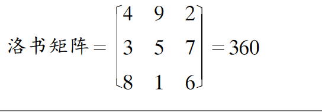

恰合周天360度数， 亦是天文学、 气象学、 历法学、 运气学说等领域内的一重要节律数。  

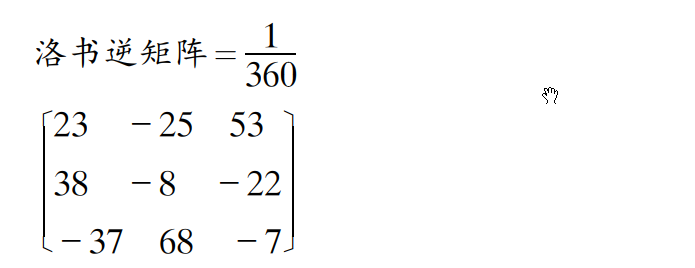

（3）洛书矩阵相当于均质条件下的应力矩阵为二阶张量。  

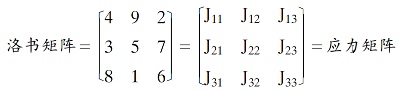

### （二）洛书几何  

洛书几何是今人将洛书与解析几何结合发展的学说（ 见图示）。 主要内容有：  

（1）洛书坐标系统。 三个洛书基矢为：  

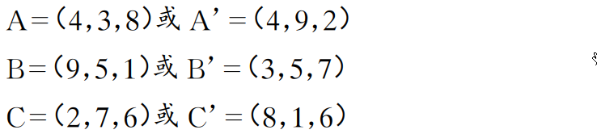

（2）洛书坐标系中基矢的数量特性、 几何物性及其不变性  

（3）洛书几何中的点线面体网络结构。 如： 洛书的三角平面， 平面方程为：X+Y+Z=15， 洛书平行六面体， 由三根洛书基
点组成其三根轴， 其体积由洛书基矢的标积得到  

（4）洛书几何的数字标量场、 标度和矢量场。 这种建立于数字线密度基础上的洛书平面场是一种统一场。  

(5）洛书几何的基本定理， 如： 洛书基矢的菱形定则、 洛书矢 量空间的存在性等（ 参考美籍华裔学者焦蔚芳《焦氏洛书数字几何学导论》）。  

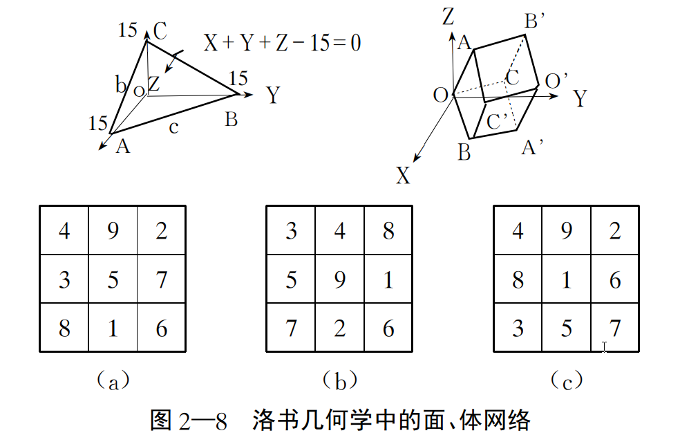

### （ 三）洛书空间  

洛书空间本身自包含有函数、 矢量和数字三个次空间  

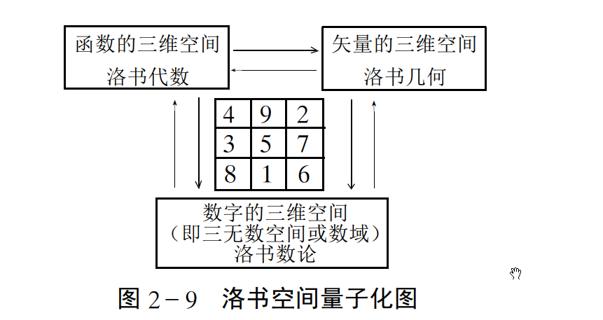

#### 洛书空间的主要特性有：  

（1）洛书空间一定是一个线性系统， 构成该空间的数学操作是加与乘；
（2）洛书空间是无限的， 但是通过数学操作亦可变成有限的；
（3）洛书空间为连续的， 但也可被数学运算划分成许多互不连续的组合；
（4）洛书空间可由实数和虚数、 有理数和无理数组成；
（5）洛书空间并非一成不变， 而是可以重复地臌胀与收缩；
（6）洛书空间具有均质、 对称和平衡性；
（7）洛书空间能作周期性地运动或永不休止地变化；
（8）洛书空间具有量子化的特质。  

