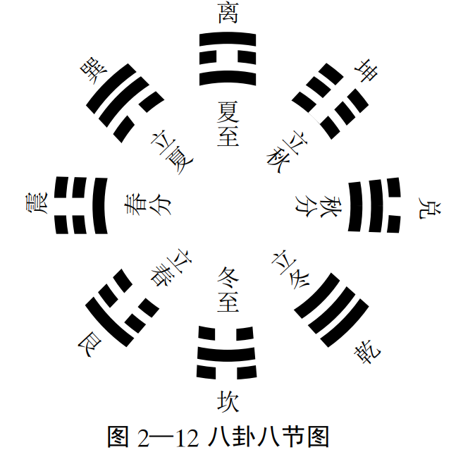
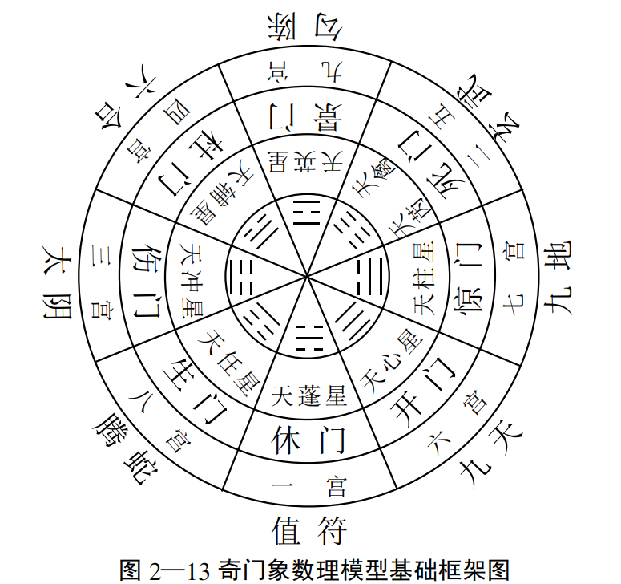
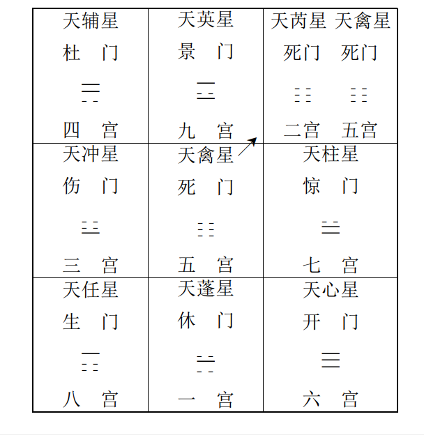

# 1.洛书九宫

## 1》洛书九宫排列规则

上图特点：每一条直线(横，竖，斜)之和都是15

《系辞》说“ 洛书概取龟象， 故其数戴九履一， 左三右七， 二四
为肩， 六八为足”， 具体有以下几个特点。
（ 一）阳正阴隅。 一、 三、 七、 九为阳， 分居北、 东、 西、 南四正
方位， 二、 四、 六、 八为阴， 分居西南、 东南、 西北、 东北四隅之地，
五居中央。
（ 二）阴阳分离。 阴阳独立各居， 彼此互不相抱， 生成单处，
自有形体。
（ 三）有始无终。 自一至九， 其十不备， 是以生机不已， 动息
不停。  

四）阳君阴臣。 奇为正， 偶为侧， 君居正而臣居侧， 四正之
阳统四隅之阴。
（ 五）阴阳均衡。 纵行、 横行、 对角线三自然数之和均为十  五， 是谓常数， 以象阴平阳秘， 阴阳均衡。   （见上图）

### 对于八风图2-2的解释注意，这里的八风（实风，也叫天之八风）和下面的八风是不一样的。

坎宫， 叶蛰之宫， 主冬至、 大寒、 小寒三节， 为大刚风。 损伤人体， 内舍于肾， 外在于骨及肩背， 其病为寒。
艮宫， 天留之宫， 主立春、 雨水、 惊蜇三节， 为凶风。 损伤人体， 内舍肠胃， 外在两胁、 脚节。
震宫， 仓门之宫， 主春分、 清明、 谷雨三节， 为婴儿风， 损伤人体， 内舍于肝， 外在筋纽， 其病主湿。
巽宫， 阴洛之宫， 主立夏、 小满、 芒种三节气， 风从东南方来，为弱风， 损伤人体， 内舍于胃， 外在肌肉， 其病气主体重。
离宫， 上天之宫， 主夏至、 小暑、 大暑三节， 风从南方来， 为大弱风， 损伤人体， 内舍于心， 外在于脉， 其病为热  

坤宫， 玄委之宫， 主立秋、 处暑、 白露三节， 风从西南方来， 为谋风， 损伤人体， 内舍于脾， 外在于肌肉， 其病衰弱。
兑宫， 仓果之宫， 主秋分、 寒露、 霜降三节， 风从西方来， 为刚风， 损伤人体， 内舍于肺， 外在皮肤， 其病为燥。
乾宫， 新洛之宫， 主立冬、 小雪、 大雪三节， 风从西北来， 为折风， 损伤人体， 内舍小肠， 外在于手太阳脉， 其病主暴死。  

## 2》 洛书九宫配九星、 八卦、 八门  

奇门遁甲中， 将洛书九宫分配九星、 八卦、 八门， 形成了奇门
象数理模型的地盘基本框架结构， 具体如图所示。   

## 3》、 洛书九宫配八风（虚风，也叫病之八风）、 十二律、 十二辰、 二十八宿  

**广莫风**， 居北方坎一宫， 主寒气广远来自沙漠， 阳气在下。时主十一月， 建子， 律应黄钟， 星宿为虚女。
**条风**， 居东北艮八宫， 主天地融冻， 万物开始逐渐生发条达。时主十二月、 正月， 月建丑寅， 律应大吕， 太簇， 星主牛斗箕房。
**明庶风**， 居东方震三宫， 主阳气上升， 万物明出茂盛。 时主二月， 建卯， 律配夹钟， 星主氐、 亢、 角。
**清明风**， 居东南巽四宫， 主天气明净清朗。 时主辰、 巳二月，律配姑洗、 仲吕， 星主轸、 星、 张。
**景风**， 居南方离九宫， 主万物高大茂盛， 阳气已终， 律配蕤宾， 时值午月， 星应柳、 井。
**凉风**， 居西南坤宫， 主风夺万物之气， 衰老进入收成之期， 时值未申二月， 律配林钟、 夷则， 宿应参、 毕。  

**阊阖风**， 居西方兑宫， 主万物成而收藏之， 时为酉月， 律配南吕， 宿应昴、 胃。
**不周风**， 居西北乾宫， 主阴气盛极之时， 配戌亥二月， 律应无 射， 应钟， 宿配娄奎  

## 4》洛书九宫与古代星空地域分野  

### 分野是什么？

中国古代天文学将天上某一星区同地上某一地区对应起来， 并按一定的规则把它们划分为若干不同区域， 而后通过观测
天象变化， 来分析预测地面人事变化的吉凶祸福， 这就叫作分野。  

## 5》洛书九宫与奇经八脉相配  

洛书九宫与奇经八脉的相配关系，在传统中医针灸学中主要通过**灵龟八法**（又称奇经纳卦法）来体现，即将洛书九宫的数字与八脉交会穴及八卦方位进行对应。 [[1](http://swmac-app.blogspot.com/2011/04/blog-post_23.html), [2](https://www.epochtimes.com/gb/6/10/22/n1495223.htm)]

洛书九宫与八脉交会穴的对应关系

根据古典针灸歌诀（如《针灸大成》中的八法歌），洛书九宫之数与八卦、奇经八脉交会穴的配合如下： [[1](http://swmac-app.blogspot.com/2011/04/blog-post_23.html)]

- **坎一**：对应 **申脉**（通于**阳跷脉**，属足太阳膀胱经）
- **坤二 / 坤五**：对应 **照海**（通于**阴跷脉**，属足少阴肾经）
- **震三**：对应 **外关**（通于**阳维脉**，属手少阳三焦经）
- **巽四**：对应 **足临泣**（通于**带脉**，属足少阳胆经）
- **乾六**：对应 **公孙**（通于**冲脉**，属足太阴脾经）
- **兑七**：对应 **内关**（通于**阴维脉**，属手厥阴心包经）
- **艮八**：对应 **后溪**（通于**督脉**，属手太阳小肠经）
- **离九**：对应 **列缺**（通于**任脉**，属手太阴肺经）
- *（中央 **五** 寄于坤土，合而为用）*

核心应用：灵龟八法

- **原理**：将人体奇经八脉相交会的八个特定腧穴，按照洛书九宫的数理时空规律，依据每日、每时的天干地支进行运算推导。
- **配穴规律**：八脉交会穴在九宫中阴阳相配、表里呼应，分为四组（如公孙配内关、后溪配申脉等），用以调理人体气血阴阳、疏通经络。

## 6》洛书与阴阳寒热比数  

## 7》洛书九宫与现代数学  

### （ 一）洛书矩阵

洛书矩阵即是洛书和矩阵结合发展的学说， 主要结论有：
（1）存在逆矩阵， 且为一个三元数之和均为24（15？）的幻方。
（2）洛书矩阵为洛书空间中的平面方程的一种表达方式：
洛书矩阵

恰合周天360度数， 亦是天文学、 气象学、 历法学、 运气学说等领域内的一重要节律数。  

（3）洛书矩阵相当于均质条件下的应力矩阵为二阶张量。  

### （二）洛书几何  

洛书几何是今人将洛书与解析几何结合发展的学说（ 见图示）。 主要内容有：  

（1）洛书坐标系统。 三个洛书基矢为：  

（2）洛书坐标系中基矢的数量特性、 几何物性及其不变性  

（3）洛书几何中的点线面体网络结构。 如： 洛书的三角平面， 平面方程为：X+Y+Z=15， 洛书平行六面体， 由三根洛书基
点组成其三根轴， 其体积由洛书基矢的标积得到  

（4）洛书几何的数字标量场、 标度和矢量场。 这种建立于数字线密度基础上的洛书平面场是一种统一场。  

(5）洛书几何的基本定理， 如： 洛书基矢的菱形定则、 洛书矢 量空间的存在性等（ 参考美籍华裔学者焦蔚芳《焦氏洛书数字几何学导论》）。  

### （ 三）洛书空间  

洛书空间本身自包含有函数、 矢量和数字三个次空间  

#### 洛书空间的主要特性有：  

（1）洛书空间一定是一个线性系统， 构成该空间的数学操作是加与乘；
（2）洛书空间是无限的， 但是通过数学操作亦可变成有限的；
（3）洛书空间为连续的， 但也可被数学运算划分成许多互不连续的组合；
（4）洛书空间可由实数和虚数、 有理数和无理数组成；
（5）洛书空间并非一成不变， 而是可以重复地臌胀与收缩；
（6）洛书空间具有均质、 对称和平衡性；
（7）洛书空间能作周期性地运动或永不休止地变化；
（8）洛书空间具有量子化的特质。  

## 2》 遁甲阴阳十八局和奇仪九宫分布  

奇仪， 是奇门遁甲中对十天干的统称， 其中把戊、 己、 庚、 辛、壬、 癸称作六仪， 把乙、 丙、 丁称作三奇， 甲则“ 隐藏”于戊的背后，换句话说就是每遇到甲的时候， 则以戊替代， 即甲、 戊同看。 这一点也正是所谓“ 遁甲”的来历。  

我们在使用奇门遁甲模型模拟预测时，第一步就是首先确定遁甲用事局象， 即从阴阳十八局中挑选一
种符合特定时空条件的局象。 其具体的排列规则如下：  

1.在八卦九宫格中， 顺布六仪， 逆布三奇即称之为阳遁， 共有九种排列方式， 故称阳遁九局， 其中戊起始（ 奇门称起元）于几
宫， 就叫做阳遁几局。
例如： 阳遁一局， 戊起布于坎一宫， 依次二宫、 三宫、 四宫、 五宫、 六宫， 把己、 庚、 辛、 壬、 癸排列其中， 即己在坤二宫， 庚落震三宫， 辛落巽四宫， 壬落中五宫， 癸落乾六宫， 剩余兑七宫， 艮八宫、离九宫三宫， 恰配乙丙丁三奇， 逆而行之， 即乙配九宫， 丙则配八宫， 丁配七宫。 如图所示

2.在九宫格中， 逆布六仪， 顺布三奇即称阴遁， 共有九种排列方式， 故称阴遁九局。 其中戊起始（ 起元）于几宫， 就叫做阴遁
几局。
例如： 阴遁八局， 戊起布于艮八宫， 逆行九宫仿次是七宫、 六宫、 五宫、 四宫、 三宫， 分别将己、 庚、 辛、 壬、 癸排列其中， 即己在兑七宫， 庚落乾六宫， 辛落中五宫， 壬落巽四宫， 癸落震三宫， 余九宫、 一宫、 二宫， 恰配乙丙丁三奇， 顺行布之， 即乙配九宫， 丙落一宫， 丁落二宫。 如图所示。  

## 3》后天八卦  

#### 一、 后天八卦的时间意义  

春天是万物生长的开始， 亦即春雷一声响， 万物始发生的意思， 用震卦表示。立夏时， 万物都长得整齐了， 用巽卦表示。 夏至时， 是太阳升得最高的时候， 万物都受到阳光的照射， 互相都可以见到， 用离卦表示。 立秋的时候， 也是最辛勤劳累的时候， 用坤卦表示。 到了秋分的时候， 则是收获的季节， 人们的心情非常喜悦， 用兑卦表示。 到了立冬的时候， 是阴与阳， 明与暗挣扎交替的时刻， 用乾
卦表示。 到了冬至的时候， 是天气最寒冷的时候， 也是人类最难以生存的时候， 用坎卦表示。 直到立春时， 天气始暖， 一冬的时
间终于过去了， 新生机又开始了， 用艮卦表示。   

八卦与八节二十四节气的具体配置如下  

冬至起配坎卦， 统辖冬至、 小寒、 大寒三节气；
立春起配艮卦， 统辖立春、 雨水、 惊蜇三节气；
春分起配震卦， 统辖春分、 清明、 谷雨三节气；
立夏起配巽卦， 统辖立夏、 小满、 芒种三节气；
夏至起配离卦， 统辖夏至、 小暑、 大暑三节气；
立秋起配坤卦， 统辖立秋、 处暑、 白露三节气；
秋分起配兑卦， 统辖秋分、 寒露、 霜降三节气；
立冬起配乾卦， 统辖立冬、 小雪、 大雪三节气。  

#### 二、 后天八卦的空间意义  

将后天八卦分别与八方相配， 即坎配北方， 离配南方， 震配东方， 兑配西方， 巽、 坤、 艮、 乾分别配东南、 西南、 东北、 西北四
隅， 于是后天八卦便又被赋予了不同的空间意义。  

#### 三、 后天八卦与万物类象  

##### 八卦的作用

乾卦的作用应该是主宰万物， 其行动积极、 坚强、 果断； 坤卦的作用是收藏万物， 平静而柔顺； 震的作用是促使万物运动； 巽的作用
是使万物消散， 其好动而慢， 进退无常， 遇难则不进； 离的作用则是具有火的性质， 向上， 易激动， 喜轰轰烈烈； 坎的作用是险陷，
润下， 使万物湿润， 处境艰难而不得外援； 兑的作用是使万物喜悦， 其性偏激； 艮的作用是使事物保持固定状态， 喜静。   

##### 可把天地万物划分成以下八个大类  

###### 乾 卦 类  （天）

乾卦特性： 乾为天， 具有天的功能和意识， 刚健、 充满、 迅速、向上为其基本特性。
人物类象： 测国事则象国君、 主席、 总统； 测单位事， 象总经理、 厂长； 测家庭事象父亲、 长辈、 丈夫； 在社会人物则象社会名
人、 官贵、 老者。
人事类象： 果断、 多动少静、 直爽痛快。
场所类象： 大城市、 首脑居所、 名胜豪华之地、 高亢之所。
人体类象： 在外象头、 右腿、 男性生殖器， 在内象肺、 骨骼。
动物类象： 龙、 虎、 狮、 象、 马、 天鹅。
静物类象： 金玉珠宝、 圆物、 坚物、 植物果实、 镜类、 冠类。
天时类象： 冰、 雹、 云、 晴天。
方位： 西北方  

时间： 秋季， 农历九、 十月， 戌亥年、 月、 日、 时， 金旺之时。
数字： 一（ 先天八卦数）， 六（ 九宫数）， 四、 九（ 五行数）
颜色： 大赤、 玄色、 白色。
五味： 辛辣
姓字： 带金字旁者， 商音  

###### 坎 卦 类  （水）

坎卦特性： 坎为水， 具有水的功能和特点， 常代表险阻、 艰难、 阴柔、 波动、 漂流等特性。
人物类象： 测国事常象主管思想和意识形态领域的部门或
人员， 如哲学家、 思想宣传部门、 演艺界、 科研工作者或部门。 测单位事常象会计、 出纳及流动性较强的部门或人物； 测家庭事为
中男， 在社会人物常为旅客、 船工、 江湖之人、 盗贼、 逃亡者、 黑社会人员、 酒鬼、 娼妇、 歌舞厅、 餐饮业、 自来水公司工作人员。
人事类象： 险陷卑下， 外柔内刚， 漂泊不定， 随波逐流。
场所类象： 北方、 江湖、 溪涧、 泉井、 卑湿之地、 下水道、 酒店、浴室、 水族馆、 妓院、 色情场所、 自来水公司。
人体类象： 在外为耳、 排泄系统， 在内象肾水系统， 血液系统  

动物类象： 水族类动物、 猪、 鼠、 狐。
静物类象： 酒、 油、 液体食物、 石油、 药品、 弓轮、 乐器、 带核之物、 冷藏设备、 计算器、 录像带、 浮萍、 潜水艇。
天时： 雨、 月、 雪、 霜、 露
方位： 北方
时间： 农历十一月， 壬子、 癸亥年、 月、 日、 时
数字： 一、 六  

颜色： 黑色
五味： 咸
姓字： 点水傍， 羽音， 排行一、 六  

###### 艮 卦 类  (有 **gèn** 和 **gěn** 两个常用读音) (山)

艮卦特性： 艮为山， 为止， 具有山的性格特点， 常表现为静止、 诚实、 安定、 等待、 浑厚等特性。
人物类象： 少男、 青少年、 宗教徒、 仆从、 警卫人员、 门卫、 继承者、 石匠、 储蓄所人员。
人事类象： 阻隔、 进退不决、 宁静、 反背。
场所类象： 山地、 坟墓、 堤坝、 寺庙、 楼观、 城墙、 贮藏室、 警卫室、 派出所、 储蓄所。
人体类象： 在外类手指、 骨、 鼻、 背， 在内象脾、 胃系统。
动物类象： 狗、 虎、 牛、 豹尖嘴利齿动物， 昆虫、 爬虫类动物。
静物类象： 桌子、 床、 柜台、 山坡、 土堆、 门坎、 坟墓、 阶梯、 钟磬。
天时： 云、 雾、 山岚。
方位： 东北方  

时间： 冬春之交， 农历十二月、 正月、 丑寅年、 月、 日、 时。
数字： 五、 七、 八、 十
颜色： 黄色
五味： 甘甜
姓字： 土字傍或部首姓氏， 宫音， 排行五、 七、 十。  

###### 震 卦 类  （雷）

震卦特性： 震为雷， 为动， 具有发展、 变动奋起、 高升等特性。
人物类象： 国家或单位的骨干力量， 在家庭为长子， 社会人 物类社会活动家， 军事指挥员、 运动员、 驾驶员、 精力充沛者， 脾
气暴躁者。
人事类象： 虚惊震动、 起动、 动怒。
场所类象： 游乐场、 机场、 车站、 道路闹市、 草木之所、 窗户台阶。
人体类象： 在外为手足、 眼、 发、 声音， 在内类肝胆系统。
动物类象： 龙、 蛇及善奔鸣之马、 百虫、 鲤鱼。
静物类象： 枪、 炮、 鼓、 钢琴、 乐器、 电话、 机动车辆、 树林、 竹、苇  

天时： 雷
方位： 东方
时间： 卯年、 月、 日、 时， 春三月。
数字： 四、 八、 三
颜色： 青绿碧
五味： 酸
姓字： 草木姓氏， 角音， 行位四、 八、 三  

###### 巽 卦 类  (风)

巽卦特性： 巽为风， 具有深入、 流动、 谦逊自由运动、 渗透性等特性。
人物类象： 家庭类象长女、 妻妾； 社会人物类象商人、 僧尼、特异功能者、 旅行者、 流浪艺人。
人事类象： 柔和不定， 进退不果， 利市三倍。
场所类象： 草木茂秀之地、 花果菜园、 交易场所、 邮局、 管道、隘路、 寺观楼台。
人体类象： 在外类股肱左肩， 内象胆系统、 气， 病患风疾。  

动物类象： 鸡、 鹤、 鱼、 蛇、 蚯蚓。
静物类象： 木制品、 纤维品、 绳索、 风扇、 工巧之器、 羽毛、 邮票、 香烟、 信件。
天时： 风
方位： 东南方
时间： 春夏之交， 乙、 丙、 辰、 巳年月日时。
数字： 四、 八、 三
颜色： 青绿
五味： 酸
姓字： 草木傍之姓字， 角音， 行位四、 三、 八  

###### 离 卦 类  (火)

离卦特性： 离为日， 为火， 代表光明、 美丽、 干燥、 文明、 附属等性质和状态。
人物类象： 家庭人物类中女或中年妇女， 社会人物象文人、艺术家、 美貌者、 演员， 在单位为中层工作人员， 或与文秘、 票据
类相关人员和部门。
人事类象： 热烈、 虚荣、 计策、 计划。
场所类象： 风景区、 光明之地、 窑冶之处、 华丽街道、 学校、 影剧院、 画院、 图书馆。  

人体类象： 在外象目、 额、 面， 在内应心血系统。
动物类象： 有美丽花纹的动物， 野鸡、 雀、 蚌、 蟹、 鳖、 龟。
静物类象： 字画、 书籍、 文化类用品， 文书合同、 票据、 支票、电视机、 摄像机等影视用品， 照明类灯具、 广告、 霓虹灯， 与火有
关的物品、 火炉、 打火机等。
天时： 日、 电、 虹、 霓、 霞  

方位： 南方
时间： 夏月， 丙午火年、 月、 日、 时。
数字： 三、 二、 七
颜色： 红色、 赤色、 紫色。
五味： 苦
姓字： 带火及立人傍， 徵音， 行位三、 二、 七。  

###### 坤 卦 类  （地）

坤卦特性： 坤为地， 为顺， 具有堆积众多、 柔顺、 稳健、 潜藏等性质和状态。
人物类象： 国家类皇后、 第一夫人， 家庭类母亲、 女主人， 社
会人物女老板、 书记、 胖女人、 大腹者、 乡人。
人事类象： 柔顺、 懦弱、 吝啬、 众多、 迟缓、 谦虚、 顺从、 消极。
场所类象： 旷野、 乡村、 平地、 仓库、 人烟稠密之地、 阴人阴气较旺之地。
人体类象： 在外类腹、 右肩， 在内应脾胃系统， 女性生殖器。
动物类象： 牛、 百兽、 牝马。
静物类象： 方物、 柔物、 布帛、 丝绵、 五谷、 土中之物、 舆车、锅  

天时： 西南方
时间： 辰戌丑未月， 未申年、 月、 日、 时。
数字： 二、 五、 八、 十。
颜色： 黄、 黑
五味： 甘
姓字： 土字傍， 宫音， 行位八、 五、 十。  

###### 兑 卦 类  （泽  ）

兑卦特性： 兑为泽， 为悦， 具有喜悦、 和睦、 言词诱惑等性质和特点。
人物类象： 少女、 妾， 社会人物类象与嘴相关的职业或人员，如评论家、 说客、 演说家、 歌唱家、 巫师、 占卜者。
人事类象： 喜悦、 口舌、 谗毁、 饮食
场所类象： 沼泽、 水池、 湿地、 娱乐场、 音乐厅、 咖啡馆、 酒家、废墟、 洞穴、 山口、 井。
人体类象： 在外象口、 舌， 内应肺、 喉、 痰涎。
动物类象： 羊， 泽中之物。
静物类象： 金刃、 乐器、 缺器、 废物  

天时： 雨泽、 新月、 星。
方位： 西方
时间： 秋八月， 辛酉年、 月、 日、 时。
数字： 四、 二、 九。
颜色： 白色
五味： 辛辣
姓字： 带口带金字傍， 商音， 行位四、 二、 九。

## 4》奇门象数理模型的基础框架  

### 奇门遁甲中洛书九宫，九星，八神，八门的对应关系  

一宫配坎卦、 休门、 天蓬星。
二宫配坤卦、 死门、 天芮星。
三宫配震卦、 伤门、 天冲星。
四宫配巽卦、 杜门、 天辅星。
五宫配坤卦、 死门、 天禽星， 寄二宫。
六宫配乾卦、 开门、 天心星。
七宫配兑卦、 惊门、 天柱星。
八宫配艮卦、 生门、 天任星  

#### 注意

八神的配置情况则不是固定的， 它首先需要根据用事时间确定了九星值符以后， 然后再分阴阳二遁两种情况， 分布排列，
阳遁顺排九宫， 阴遁逆排九宫。  

#### 为了便于书写， 可把上图改写为如下方格图式  

## 5》奇门象数理模型的总体思维设计  

### 一、 科学的一些解析  

#### 第一步： 后天八卦配洛书九宫  

#### 第二步： 九宫、 八卦、 九星、 八门、 八神的综合静态配置， 用以模拟描述地球表面万物信息能量场， 可姑且称之为“口 统一 场”的常态分布状况  

（ 一）“**口** ”为万物之源  （这个“口”是一种符号，读作气）

“口 ”， 现代辞典中解释同“ 气”， 实则其内涵和意义较此种解释要广泛而深刻地多。 这里古人所谓的“口 ”， 是指一切事物（ 包
括今人所说的各种气态物质在内的）内在的、 流动的本质体现，它是构成一切物质的本源， 是形成天地万物的最基本元素， 如老
子所说“ 天地万物一 口耳”。 在现代科学看来，“口 ”应该是一种微粒流， 有些类似现代物理学中的磁场。 有关“口 ”的最早的自
然科学方面的解释， 是德国科学家莱布尼兹提出的“口 ”即“ 以太”的见解。   

当代物理学家何祚庥曾提出“ ”与量子场中的“ 场”极为相似的观点， 认为“ ”与其说接近“ 以太”， 不如说更接近现代科学所说的“ 场”  

（ 二）“**口**  ”的聚散变化形成宇宙万物  

古代思想家认为  世界上的形形色色， 不管是物质现象， 还是精神现象， 所有都是得到了“ 精气”， 才能够存在， “ ”的周流六虚的不断变化， “ 聚则成形， 散则为气”， 在天可化为列宿星辰， 在地可形成五谷山川， 它具有“ 阴阳不测”之造化功能， 这也就是所谓的鬼神。 万物之中， 人秉受五行至真至纯至中之“ ”， 是故人能够成为万物之灵。  在人们胸中， 精气深凝， 即聚敛精气多者， 则成为圣人。 亦如孟子所云“ 吾善养吾浩然之气”。   总之，“ ”的造化功能浩然光耀而遍布周天， 深不可测者又如入深渊  

（三）“ ”的运行变化具有一定的规律  

古人通过多方面的实践和感知  设制了干支、 八卦、 九宫、 九星等等这些象数理符号， 以及多种易学数术模型  

我们就来具体认识一下奇门遁甲模型中各要素符号所主要表示的意义。  

九宫： 它所主要表示的是时间和空间意义。
八卦： 其所表现的意义侧重于万物类象及其本质属性。
九星： 其所表示的意义是来自于星际空间影响地球人类活动和人事变化的能量信息。
八门： 代表天地发生作用之后， 在大地形成的直接影响人事谋为吉凶利弊的不同气场的能量信息分布情况。
八神： 代表另一种影响人类生活的神秘力量， 故可称之为“ 神”的作用和能量信息  

（ 四）一些有关“ **口**”和“ **口**场”的科学解释说明  

1. 九宫八卦场的存在  

   后天八卦场配应人体是基本相符的。 《内经》讲北为坎水，在人体为肾； 南为离火， 在人体为心； 东为震， 属木， 在人体为肝；
   西为兑， 属金， 在人体为肺。 根据“ 天人相应”我们看场与人是否相应？ 北方为坎， 气场属水， 即强肾。 中医讲肾主骨， 技巧出焉，肾脏强骨骼必发达。 我们看北方人身高体健， 运动员常到北方选拔。 南为离火， 为心。 中医讲“ 心主神明”， 即大脑聪明思维敏捷。 南方人做生意很灵活， 北伐战争也是从南方发动的。 为改变命运漂洋过海， 当华侨的南方人比例最大。 西方属肺金，“ 肺   开窍于鼻”， 所以鼻子的大小可以断定肺的功能。 新疆人， 乃至西方洋人的鼻子很发达。 “ 肺又主悲”， 西北的秦腔很有特点， 听起来悲悲切切。 东为肝木， 肝主胆略， 也主怒。 胆子大， 看山东人的性格直爽。 水浒传中的一百零八将山东人偏多。 气场是随地理分布变化的， 所以说， 人体的体形， 秉性是气场影响塑造的  

   气场不仅塑造了不同类型的人， 而且决定了万物的差别。
   中医认为“ 土能生长万物”， 以土壤为例， 观察一番土的五色。 北大荒是含腐殖质高的黑土； 广东则是含矿物质的红土； 山东、 苏
   北的土是青色， 好像水泥色； 西边是白色的， 极淡的黄色， 似牛奶； 中央地河南、 河北则是黄色土。 这五色对应着人体的内脏；
   肾黑、 心赤、 肝青、 肺白、 脾黄。 北京中山公园的五色土把天下五色之土集中在一个石台之上， 与其说“ 普天之下， 莫非王土”是皇权的体现， 不如说是个古老土壤的“ 全息模型”。  

​	八卦气场通过五脏影响人体， 这个事实已由学者在实验室中进行模拟研究得到了验证。
​	用磁铁或电磁线， 每三个一组， 按阴阳爻排成八个卦象， 其次序取先天八卦之序。 体验者在卦中面南坐北， 当乾卦转向南
​	时， 肺凉脚热； 当坤卦转向南时（ 反卦位）， 脾热脚凉； 当离卦转向南时， 心热肾凉； 当坎卦转向南时， 肾热心凉； 当肺卦转      	向南时，肺热； 当艮卦转向南时， 脾热； 当震卦转向南时， 肝热。 不难看出， 在上述人造的附加八卦场中， 人的脏腑感觉基本与相	应方位的属性相关联。  

2. 八门信息场的影响  

   有人用奇门遁甲八门理论研究中国历史上十一次大的统
   一， 发现一个奇特而普遍性的规律， 那就是当最终形成两大政治  势力争夺中国的最高统治权的时候， 几乎总是占据开、 休、 生三
   吉门的一方获胜， 从而实现了中国的统一。 历史上统一中国的
   周、 秦、 汉、 晋、 隋、 唐、 宋、 元、 清等王朝及中华人民共和国都是如此， 它们统一的方向， 都是从北向南。 只有明王朝是个例外。 明王朝首先在南京建立了政权， 然后北伐统一了中国， 但是朱元璋死后不久， 其占据北方的儿子朱棣又挥师南下， 打败了朱元璋的孙子建文帝， 坐上了皇帝的宝座。 从奇门遁甲的角度来看， 是进行了一次内部调整， 才使中国正式安定下来。  

   从奇门遁甲三吉门向其他方位进军， 可以说是形成统一中国的军事战争的一个基本规律。
   从相反的一面看也是如此。 除了王朝之外， 建立在江南、 四川的大小朝廷， 都没有能力统一中国的政权。 如三国的蜀与吴、
   东晋、 南宋、 太平天国以及近代国民革命政府和蒋介石的国民党政权都是如此。通过以上重大史实的研究发现， 因此有人提出八门气场作用于人事活动利弊吉凶的影响和力量， 不可忽视， 亦很值得进行一番科学的研究和探讨  

3. “ **口**”与地球生物学  

   地球生物学是当今西方出现的又一门新兴学科， 它诞生于美国， 目前已越来越受到国外不论是科学界人士， 亦还是普通居
   民百姓的关注与重视。 其目的也正是专门研究环境与人体健康之间相互作用的科学， 其中一些观点和古人所谓的“**口** ”、 “**口** 场”
   颇有些类似。   

4. “ **口**”与微波辐射  

   宇宙幅射是维持宇宙本身存在的能量， 它是现代物理学所讲的“ 粒子”与“ 场”的结合物的运动形式， 它控制着物质以及生命体的生长和变化过程， 其与我国古代思想家所说的“ ”亦有些相似之处  

#### 第三步： 奇仪的九宫排列即阴阳十八局变化， 用以进一步模拟描述“ 统一 场”， 在某一时间区域内更加具体的变化分布情况， 亦可以将之理解为“ 统一 场”周期性变化规律和特点的说明。  

干支可理解为表示一切事物时空属性以及能量信息存在和转化关系的符号， 所以在这里我们亦可将之理解为“ ”的代表符号， 古人也许
可能正是基于这种认识， 所以他们把奇仪在九宫中进行了不同的排列， 总计产生了"%种组合形式， 并用之以表示“ 统一 场”在不同时空条件下所固有的更加具体的分布和变化情况。  

在其经过反复地实践和经验之后， 有如下几个研
究发现：

1. 一候"日是“ 统一**口** 场”运动、 变化的一个相对稳定的基
   本周期。
2. “ 节”“ 气”是“ 统一**口** 场”运动变化更大范围的一个周期，
      它包括三候， 即三个基本周期的变化。
3. 冬至和夏至节是“ 统一 场”阴遁、 阳遁变化的分界线， 冬
      至以后， “ 统一 场”变化属阳遁变化形式， 夏至以后， 则属阴遁
      变化形式  

4. 奇仪的分布排列和日时干支的节律性变化亦存在着一定的关系  

##### 上述三步内容综合叠加在一起， 即构成了奇门遁甲所谓的“ 地盘”  

#### 第四步， 以十二支辰的不同时辰变化为变量参数， 在上述奇门地盘之上， 按照一定的规则， 重新排布奇仪、 九星， 如此便又形  成了奇门遁甲所谓的“ 天盘”， 它表示随日、 时干支即宇宙统一时空的变化和九星值符的变化， 在此一时辰之内， “ 天”所发挥的功能对“ 统一 **口**场”的作用和影响。  

#### 第五步： 以十二支辰的不同时辰变化为变量参数， 在奇门地盘、 天盘之上， 按照一定的规则， 重新排布八门， 即形成了奇门遁甲所谓的“ 人盘”， 它表示宇宙天地各要素作用于地球之后， 在此时辰之内， 所形成的不同方位空间， 并直接关系影响人类活动利弊的“ 统一 **口**场”的具体分布情况。  

#### 第六步： 以十二支辰的不同时辰变化为变量参数， 在奇门地盘、 天盘、 人盘之上， 按一定规则重新排布八神。 它代表象征某种神秘的所谓“ 神”的力量对“ 统一 **口**场”的作用和影响  

### 二、 哲学的有关说明  

