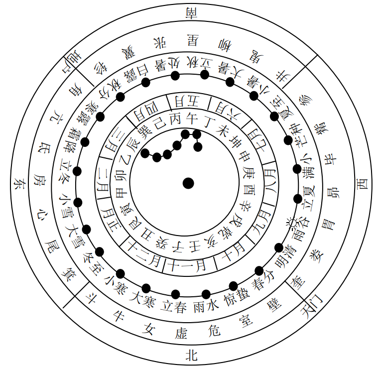
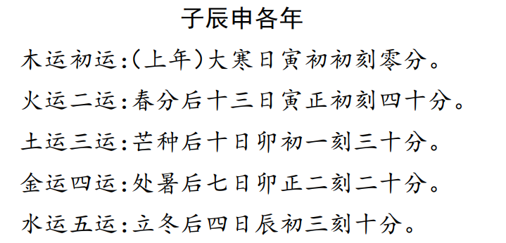
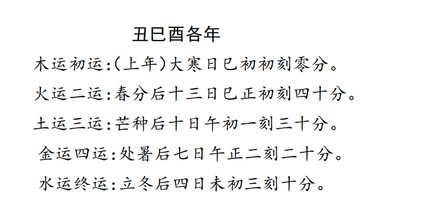
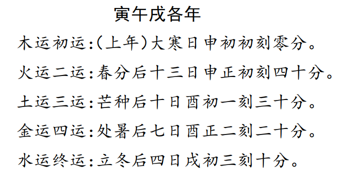
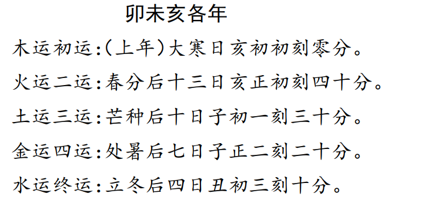
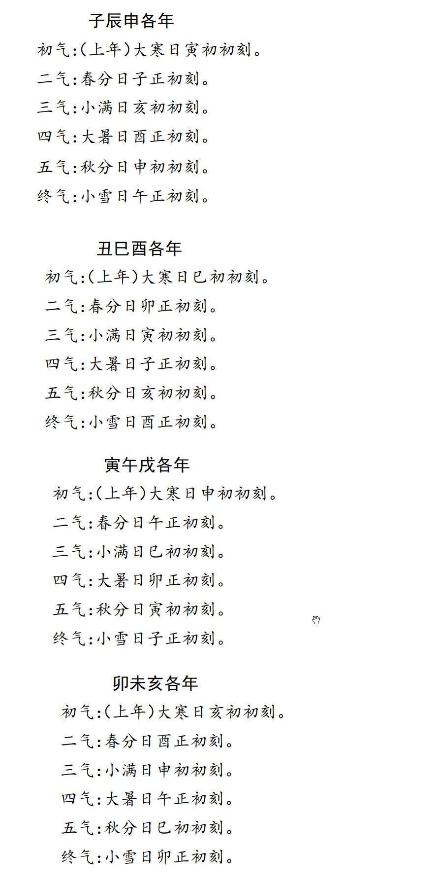

# 1.二十四节气有关常识  

## 一、节气的来历

节气的明确历史记载， 当见于战国末期秦相吕不韦集合门客编写的杂家代表著作《 吕氏春秋》， 书中对节气的划分有较为  详细系统的概括， 明确指出了“ 五日为候”， “ 三候为气”， “ 一年共七十二候， 二十四节气”这些季节性变化的规律。  

## 二、 节气的概念和具体释义  

### （ 一）节气的概念  

节气， 实指天度、 节度、 气数及其变化。 

 天度就是地球、 月亮公转、 自转运行的速度或速率。   

气数  指由于日月等天体运行的不断变化， 因而影响到地球上温度、 湿度、 阳光、 风向等出现了季节性变化， 产生形成了二十四节气等变化规律， 进而又影响到地球万物出现生、 长、 化、 收、 藏等一系列规律性的变化  

### （ 二）二十四节气具体释义  

**夏至、 冬至**
表示炎热的夏天和寒冷的冬天快要到来。 

夏至日， 公历时间一般是6月"21日、22日， 因其白昼最长， 故古代又称日长日。  

冬至日， 公历时间一般是12"月22日、23日， 因其白昼最短， 所以又称日短日。  

**春分、 秋分**  

表示昼夜平分。 此两天昼夜相等， 古时统称日夜分。 因这两个节气又正处在立春与立夏、 立秋与立冬之间， 把春季、 秋季
各平分两半， 因此也有据此来解释春分秋分的。 时间一般在公历3月21日、22日和9月23日、24日左右  

**立春、 立夏、 立秋、 立冬**  

古称四立， 是开始的意思。 立春是春天的开始， 至立夏为止。 立夏是夏天的开始， 至立秋为止。 立秋是秋天的开始， 至立
冬止。 立冬是冬天的开始， 至第二年立春止。 四立的交节时间，一般分别是公历2月4日、5日；6月7日、8日；8月7日、8日；
11月7日、8日。  

**雨水**
表示少雨水的冬季已过， 降雨开始， 雨量也开始增多。
**惊蜇**
惊蜇日开始可以听到雷声了， 蜇伏藏匿冬眠的动物被春雷惊醒， 出土活动的开始。 时间一般在公历3月6日、7日左右。  

**清明**
天气晴朗、 温暖、 草木开始现青， 清洁明净的阳光代替了草木枯黄、 满目萧条的寒冬， 交节时间， 一般在公历4月4日、5日。
**谷雨**
降雨明显增加， 雨水促使谷类作物生长发育， 古代称为雨生百谷。 交节时间般在4月20日、21日。  

**小满**
夏熟作物籽粒开始饱满， 但未成熟， 故称小满。 交节日期般在5月21日、22日。
**芒种**
表示小麦、 大麦等有芒的作物的种子已经成熟， 可以收割了， 交节日期般在6月6日、7日。  

**小暑、 大暑**
是一年中最热的季节， 小暑是开始炎热， 大暑则是一年中最热的时候， 交节时间一般在公历7月7日、8日和7月23日、24日。
**处暑**
处是终止， 躲藏之意。 表示盛夏快要躲藏了， 交节时间一般在公历8月23日、24日。  

**白露**
气温逐渐降低， 夜间温度已达成露条件， 露水凝结较多， 呈现白露， 交节期一般在9月8日、9日。
**寒露**
气温更低， 露水更凉的意思， 交节期一般在10月8日、9日。
**霜降**
气候渐寒冷， 白霜降临， 出现， 交节期一般在10月23日、24日。  

**小雪、 大雪**
入冬以后， 天气更加寒冷， 小雪是开始下雪的时候， 大雪是雪下得大， 乃至地面可有积雪了。 交节期一般在公历11月22日、23日和12月7日、8日。  

**小寒、 大寒**
寒冷的意思， 小寒是开始寒冷， 大寒则是最为寒冷的时候，交节期一般在1月6日、7日和1月20日、21日。
**二十四节气交节时间， 在以后奇门预测确定应期时要经常使用， 所以要求学者熟练记忆掌握**  

## 三、 节气与天文学  

### （ 一）节气的形成  

地球绕日公转的过程中， 太阳有时直射北半球， 有时直射南半球， 有时直射赤道。 如此以来， 便引起了地球
表面温度、 湿度、 物候等一系列综合性季节性变化， 这样便形成了不同的节气。  

古代天文学则把地球绕日公转的黄道平面， 平均分为二十四等份  形成了二十四节气

## （ 二）节气与地平方位、 斗纲月建、 二十八宿配应  

#### 什么是斗纲月建

四时和二十四节气的确立， 是对太阳周年视运动的分段， 而十二月则是根据日、 月的复合视运动而确定的。 其方法是观察
北斗七星相对于十二辰的位置以确定， 称做斗纲月建。 具体说来取日落后初昏时分为观察定时， 以斗柄所指方位确定月序。  

如初昏见北斗位东北方， 斗柄指正东时当为二月； 位正北靠天顶， 斗柄指南时， 当为五月； 位西北， 斗柄指西时， 当为八月； 位正
北， 接近地平， 斗柄指北时， 当为十一月。 后来， 古代天文学家将二十四节气， 斗纲月建， 周天二十八宿， 地平二十四方位， 十二时辰溶合为一体， 这样便形成一个中国古代天文学特有的天地时空全息综合运行系统。 （ 如图所示  3-1）

#### 图3—1天地时空全息运行图  

1. 中央点为北天极， 附近为北斗七星， 从里向外， 第一圈是
   地平二十四方位， 其中十二支又可表示十二时辰； 第二圈为月
   序， 再向外的一条带点黑线表示黄道， 其中空白一点表示太阳，
   第三圈文字是黄道点上的二十四气名； 第四圈是周天二十八宿。
2. 本图为三月时空运行情况， 故斗柄指向辰位， 太阳行于
   娄、 胃二宿间， 即黄道谷雨点， 十二时辰对应酉、 戌之间， 在方位
   对应辛位  
3. 其他节气、 斗纲、 地平方位对应关系：
   玉衡（ 北斗）指子， 冬至； 指癸， 小寒； 指丑， 立春； 指寅， 雨水；指甲， 惊蜇； 指卯， 春分； 指乙， 清明； 指辰， 谷雨； 指巽， 立夏； 指巳， 小满； 指丙， 芒种； 指午， 夏至； 指丁， 小暑； 指未， 大暑； 指坤，立秋； 指申， 处暑； 指庚， 白露； 指酉， 秋分； 指辛， 寒露； 指戌， 霜降； 指乾， 立冬； 指亥， 小雪； 指壬， 大雪  

## 四、 节气与运气学说  

运气学说  是  关于天文气象之变化， 日月五行之运动与地球气候、物候、 症候等变化关系和规律的学问 .

是以《周易》哲学思想为基础理论， 认为人与自然， 万物和宇宙是统一的不可分割的整体， 是一个有机的巨系统  

这个系统又是不断运行和变化的， 其变化的根本是五运六气的运化与交流。  

在运气学说中  我们可以看到其与二十四节气的划分， 有着至为密切的关系

#### 1.五运、 六气的概念   

五运， 指  木运、 火运、 土运、 金运、 水运， 又称岁运、 大运  

五运分类以年干确定。 甲己之年为土运， 乙庚之年为金运， 丙辛之年为水运， 丁壬之年为木运， 戊癸之年为火运。  

六气， 指风、 热、 火、 湿、 燥、 寒六气， 又称厥阴风木、 少阴君火、 少阳相火、 太阴湿土、 阳明燥金、 太阳寒水。  

#### 2.五运和六气的关系  

《内经》解释说“ 在天为风， 在地为木； 在天为热， 在地为火；在天为湿， 在地为土； 在天为燥， 在地为金； 在天为寒， 在地为水。
故在天为气， 在地成形， 形气相感而化生万物；六气为五行在天之气， 五行为六气在地之质， 两者二位一体，不可分割。  

#### 3. 主运、 主气  

主运、 主气说明一年之内， 四时、 二十四节气变化的基本“ 常规”， 即春温、 夏热、 长夏湿、 秋凉、 冬寒以及由此常规变化而引起
的自然界物候、 症候等综合变化情况。  

#### 4.客运、 客气  

客运、 客气所说的是每年气候变化的特殊情况， 如有的年份干旱， 有的年份多雨等， 指的是一种“ 变律”。
运气学说就这样把大运、 主运、 客运以及六气之主气、 客气综合加临到一起， 然后综合比较确定一年的气候变化情况以及
其与物候、 症候等变化的关系。  

#### 5.主运交变时间  

主运每步七十三日零五刻， 一年分五步运， 即初运角木司春， 二运徵火司夏， 三运宫土司长夏， 四运商金司秋， 五运终运羽
水司冬。主运基本上是固定的， 但是由于五刻的零余， 使得各运的交接时刻在每年每季略有不同， 从而呈现每四年一个周期的变化。
十二支所纪十二年恰为三个周期， 十干十年却为两个半周期而不得其齐， 因此对应于十二支纪年， 交运时间是有固定规律的，
而十干纪年则是相对变动的， 是所谓“ 阳动阴静”之理也。

######                                                                                      

#### 6.主气交变时间  

主气即主时之气， 用以说明一年之内气候的正常变化规律。分六步分司一年之二十四节气， 每步主四个节气， 共六十日又八
十七刻半。 初之气厥阴风木， 二之气少阴君火， 三之气少阳相火， 四之气太阴湿土， 五之气阳明燥金， 终之气太阳寒水。 具体
交变节律如下：  

