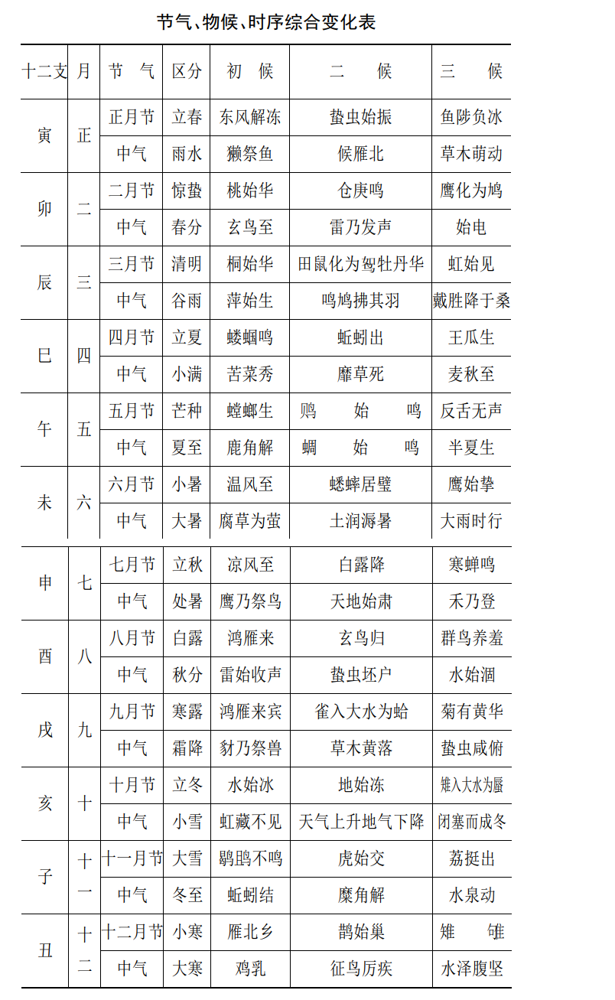
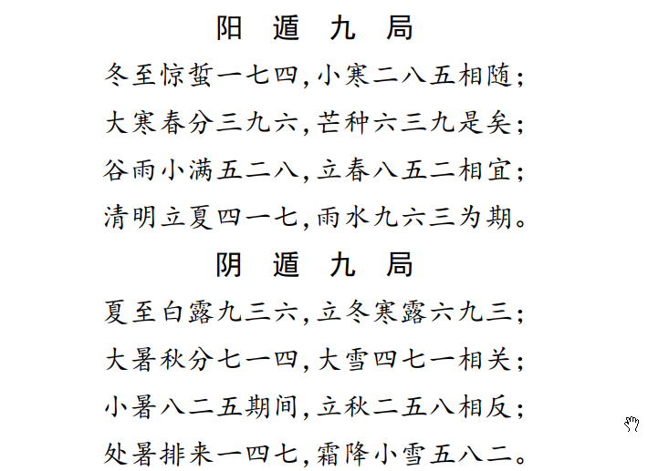
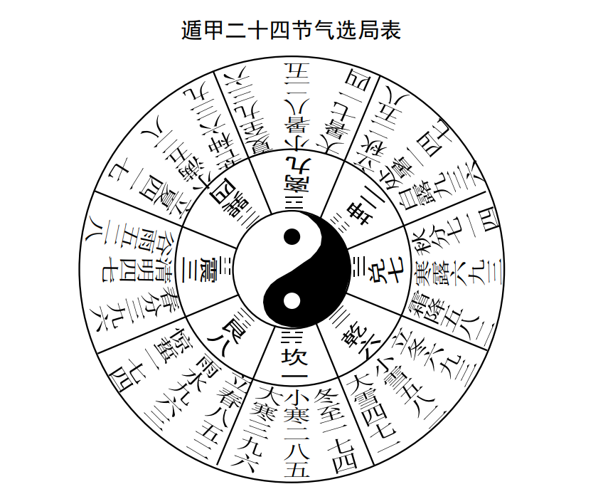
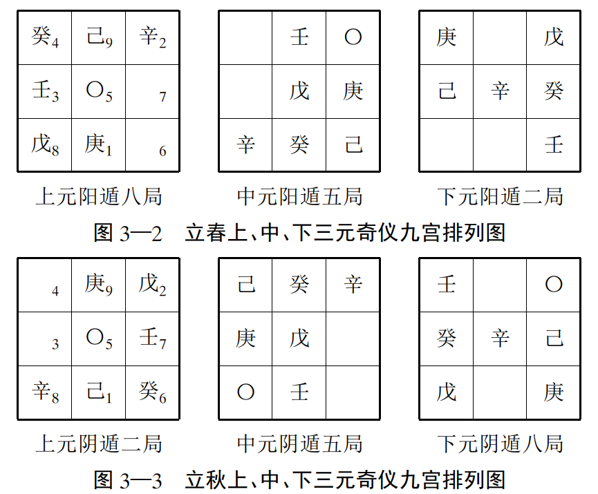
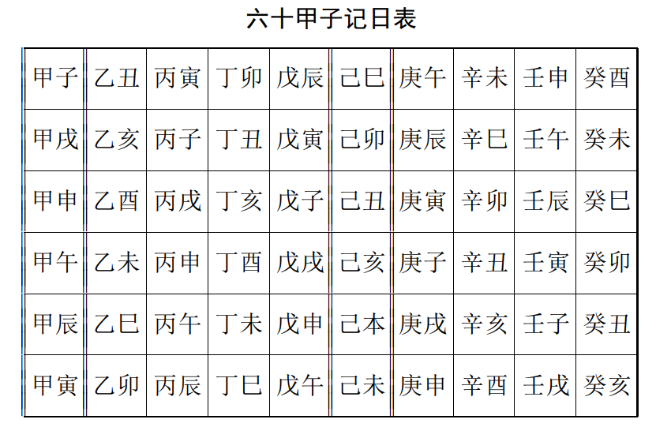

# 1.二十四节气有关常识  

## 一、节气的来历

节气的明确历史记载， 当见于战国末期秦相吕不韦集合门客编写的杂家代表著作《 吕氏春秋》， 书中对节气的划分有较为  详细系统的概括， 明确指出了“ 五日为候”， “ 三候为气”， “ 一年共七十二候， 二十四节气”这些季节性变化的规律。  

## 二、 节气的概念和具体释义  

### （ 一）节气的概念  

节气， 实指天度、 节度、 气数及其变化。 

 天度就是地球、 月亮公转、 自转运行的速度或速率。   

气数  指由于日月等天体运行的不断变化， 因而影响到地球上温度、 湿度、 阳光、 风向等出现了季节性变化， 产生形成了二十四节气等变化规律， 进而又影响到地球万物出现生、 长、 化、 收、 藏等一系列规律性的变化  

### （ 二）二十四节气具体释义  

**夏至、 冬至**
表示炎热的夏天和寒冷的冬天快要到来。 

夏至日， 公历时间一般是6月"21日、22日， 因其白昼最长， 故古代又称日长日。  

冬至日， 公历时间一般是12"月22日、23日， 因其白昼最短， 所以又称日短日。  

**春分、 秋分**  

表示昼夜平分。 此两天昼夜相等， 古时统称日夜分。 因这两个节气又正处在立春与立夏、 立秋与立冬之间， 把春季、 秋季
各平分两半， 因此也有据此来解释春分秋分的。 时间一般在公历3月21日、22日和9月23日、24日左右  

**立春、 立夏、 立秋、 立冬**  

古称四立， 是开始的意思。 立春是春天的开始， 至立夏为止。 立夏是夏天的开始， 至立秋为止。 立秋是秋天的开始， 至立
冬止。 立冬是冬天的开始， 至第二年立春止。 四立的交节时间，一般分别是公历2月4日、5日；6月7日、8日；8月7日、8日；
11月7日、8日。  

**雨水**
表示少雨水的冬季已过， 降雨开始， 雨量也开始增多。
**惊蜇**
惊蜇日开始可以听到雷声了， 蜇伏藏匿冬眠的动物被春雷惊醒， 出土活动的开始。 时间一般在公历3月6日、7日左右。  

**清明**
天气晴朗、 温暖、 草木开始现青， 清洁明净的阳光代替了草木枯黄、 满目萧条的寒冬， 交节时间， 一般在公历4月4日、5日。
**谷雨**
降雨明显增加， 雨水促使谷类作物生长发育， 古代称为雨生百谷。 交节时间般在4月20日、21日。  

**小满**
夏熟作物籽粒开始饱满， 但未成熟， 故称小满。 交节日期般在5月21日、22日。
**芒种**
表示小麦、 大麦等有芒的作物的种子已经成熟， 可以收割了， 交节日期般在6月6日、7日。  

**小暑、 大暑**
是一年中最热的季节， 小暑是开始炎热， 大暑则是一年中最热的时候， 交节时间一般在公历7月7日、8日和7月23日、24日。
**处暑**
处是终止， 躲藏之意。 表示盛夏快要躲藏了， 交节时间一般在公历8月23日、24日。  

**白露**
气温逐渐降低， 夜间温度已达成露条件， 露水凝结较多， 呈现白露， 交节期一般在9月8日、9日。
**寒露**
气温更低， 露水更凉的意思， 交节期一般在10月8日、9日。
**霜降**
气候渐寒冷， 白霜降临， 出现， 交节期一般在10月23日、24日。  

**小雪、 大雪**
入冬以后， 天气更加寒冷， 小雪是开始下雪的时候， 大雪是雪下得大， 乃至地面可有积雪了。 交节期一般在公历11月22日、23日和12月7日、8日。  

**小寒、 大寒**
寒冷的意思， 小寒是开始寒冷， 大寒则是最为寒冷的时候，交节期一般在1月6日、7日和1月20日、21日。
**二十四节气交节时间， 在以后奇门预测确定应期时要经常使用， 所以要求学者熟练记忆掌握**  

## 三、 节气与天文学  

### （ 一）节气的形成  

地球绕日公转的过程中， 太阳有时直射北半球， 有时直射南半球， 有时直射赤道。 如此以来， 便引起了地球
表面温度、 湿度、 物候等一系列综合性季节性变化， 这样便形成了不同的节气。  

古代天文学则把地球绕日公转的黄道平面， 平均分为二十四等份  形成了二十四节气

## （ 二）节气与地平方位、 斗纲月建、 二十八宿配应  

#### 什么是斗纲月建

四时和二十四节气的确立， 是对太阳周年视运动的分段， 而十二月则是根据日、 月的复合视运动而确定的。 其方法是观察
北斗七星相对于十二辰的位置以确定， 称做斗纲月建。 具体说来取日落后初昏时分为观察定时， 以斗柄所指方位确定月序。  

如初昏见北斗位东北方， 斗柄指正东时当为二月； 位正北靠天顶， 斗柄指南时， 当为五月； 位西北， 斗柄指西时， 当为八月； 位正
北， 接近地平， 斗柄指北时， 当为十一月。 后来， 古代天文学家将二十四节气， 斗纲月建， 周天二十八宿， 地平二十四方位， 十二时辰溶合为一体， 这样便形成一个中国古代天文学特有的天地时空全息综合运行系统。 （ 如图所示  3-1）

#### 图3—1天地时空全息运行图  

1. 中央点为北天极， 附近为北斗七星， 从里向外， 第一圈是
   地平二十四方位， 其中十二支又可表示十二时辰； 第二圈为月
   序， 再向外的一条带点黑线表示黄道， 其中空白一点表示太阳，
   第三圈文字是黄道点上的二十四气名； 第四圈是周天二十八宿。
2. 本图为三月时空运行情况， 故斗柄指向辰位， 太阳行于
   娄、 胃二宿间， 即黄道谷雨点， 十二时辰对应酉、 戌之间， 在方位
   对应辛位  
3. 其他节气、 斗纲、 地平方位对应关系：
   玉衡（ 北斗）指子， 冬至； 指癸， 小寒； 指丑， 立春； 指寅， 雨水；指甲， 惊蜇； 指卯， 春分； 指乙， 清明； 指辰， 谷雨； 指巽， 立夏； 指巳， 小满； 指丙， 芒种； 指午， 夏至； 指丁， 小暑； 指未， 大暑； 指坤，立秋； 指申， 处暑； 指庚， 白露； 指酉， 秋分； 指辛， 寒露； 指戌， 霜降； 指乾， 立冬； 指亥， 小雪； 指壬， 大雪  

## 四、 节气与运气学说  

运气学说  是  关于天文气象之变化， 日月五行之运动与地球气候、物候、 症候等变化关系和规律的学问 .

是以《周易》哲学思想为基础理论， 认为人与自然， 万物和宇宙是统一的不可分割的整体， 是一个有机的巨系统  

这个系统又是不断运行和变化的， 其变化的根本是五运六气的运化与交流。  

在运气学说中  我们可以看到其与二十四节气的划分， 有着至为密切的关系

#### 1.五运、 六气的概念   

五运， 指  木运、 火运、 土运、 金运、 水运， 又称岁运、 大运  

五运分类以年干确定。 甲己之年为土运， 乙庚之年为金运， 丙辛之年为水运， 丁壬之年为木运， 戊癸之年为火运。  

六气， 指风、 热、 火、 湿、 燥、 寒六气， 又称厥阴风木、 少阴君火、 少阳相火、 太阴湿土、 阳明燥金、 太阳寒水。  

#### 2.五运和六气的关系  

《内经》解释说“ 在天为风， 在地为木； 在天为热， 在地为火；在天为湿， 在地为土； 在天为燥， 在地为金； 在天为寒， 在地为水。
故在天为气， 在地成形， 形气相感而化生万物；六气为五行在天之气， 五行为六气在地之质， 两者二位一体，不可分割。  

#### 3. 主运、 主气  

主运、 主气说明一年之内， 四时、 二十四节气变化的基本“ 常规”， 即春温、 夏热、 长夏湿、 秋凉、 冬寒以及由此常规变化而引起
的自然界物候、 症候等综合变化情况。  

#### 4.客运、 客气  

客运、 客气所说的是每年气候变化的特殊情况， 如有的年份干旱， 有的年份多雨等， 指的是一种“ 变律”。
运气学说就这样把大运、 主运、 客运以及六气之主气、 客气综合加临到一起， 然后综合比较确定一年的气候变化情况以及
其与物候、 症候等变化的关系。  

#### 5.主运交变时间  

主运每步七十三日零五刻， 一年分五步运， 即初运角木司春， 二运徵火司夏， 三运宫土司长夏， 四运商金司秋， 五运终运羽
水司冬。主运基本上是固定的， 但是由于五刻的零余， 使得各运的交接时刻在每年每季略有不同， 从而呈现每四年一个周期的变化。
十二支所纪十二年恰为三个周期， 十干十年却为两个半周期而不得其齐， 因此对应于十二支纪年， 交运时间是有固定规律的，
而十干纪年则是相对变动的， 是所谓“ 阳动阴静”之理也。

######                                                                                      

#### 6.主气交变时间  

主气即主时之气， 用以说明一年之内气候的正常变化规律。分六步分司一年之二十四节气， 每步主四个节气， 共六十日又八
十七刻半。 初之气厥阴风木， 二之气少阴君火， 三之气少阳相火， 四之气太阴湿土， 五之气阳明燥金， 终之气太阳寒水。 具体
交变节律如下：  

## 五、 节气与物候、 症候变化  

### （ 一）二十四节气与物候变化  

物候是生物和非生物对天气现象、 气候变化、 节令早晏作出的规律性的系列反映。具体表现为下面的表  

### （ 二）二十四节气与时疫症候  

中医运气学说认为五运、 六气， 二十四节气的节律性变化，作用于人体， 使之脏腑气血也随之产生了旺衰更替活动， 从而进
一步又影响到人体的发病， 亦出现明显的季节性特点。  

从大寒至春分这一段时间， 气候的变化多以风为特点， 天气渐温， 草木萌发， 万物振起， 在人体来说肝藏， 厥阴用事， 肝胆
经气较旺， 其肝胆虚弱之病至此得天地本气相助， 是故， 减轻或向愈， 实病却极易加重， 外感则以风温较多。
从春分到小满这一段时间， 气候变化以温热为特点， 在人体心经用事， 心与小肠经气虚病至此可减轻或向愈， 实病则易加
重， 热病多发。
小满至大暑这一段时间， 气候变化以炎热为特点， 天气郁蒸暑热， 骄阳似火， 万物华茂盛长， 在人体少阳用事， 心包与三焦经
气旺， 暑热之病流行。
大暑至秋分这一段时间， 气候变化以湿盛为特点， 在人体太阴用事， 脾胃经气较旺， 其虚弱之病， 至此可减轻或向愈， 壅滞等
实病则会加剧。 另外受暑湿之邪所致之湿热病多发。  

秋分至小雪这一段时间， 气候变化以干燥为特点， 天气凉爽， 霜寒清肃， 草木凋零， 万物枯萎， 人体阳明用事， 肺与大肠经
气旺， 其虚弱之病， 至此易现好转， 其实之病则易加重， 外感发病以燥病为多。
小雪至大寒这一段时间， 气候变化以严寒为特点， 雪降冰卦， 万物藏匿， 在人体为太阴用事， 肾与膀胱气旺， 其虚弱之病至
此减轻， 水寒之病则易加重， 外感以伤寒较多。  

#### 此外， 据某些中医学专家研究， 五脏病和人的死亡与主气、节气的变化亦有直接关系  

肝脏病一般多死于秋季， 大暑至秋分土侮木、 金克木之时； 心脏病多死于冬季； 脾脏病在四、 五气， 即长夏、 初秋死亡最多； 肺脏病多死于春季。   

# 2.二十四节气与遁甲选局  

## 奇门遁甲的选局规律。  

### 1》 冬至、 夏至分阴阳二遁  

冬至、 小寒、 大寒、
立春、 雨水、 惊蜇、 春分、 清明、 谷雨、 立夏、 小满、 芒种十二个节气， 一律是顺布六仪， 逆行三奇， 而从夏至节以后， 万物元气活力渐失， 日趋衰退， 是故， 夏至、 小暑、 大暑、 立秋、 处暑、 白露、 秋分、寒露、 霜降、 立冬、 小雪、 大雪十二个节气一律使用阴遁九局用事， 即逆布六仪， 顺布三奇的排局方式  

### 2》 “ 每气统三为正宗”。  

每个节、 气都是15天， 分为三候，5日一候， 这样以每5日为一单元统一使用一种局象， 于是每一个节气就包括三种用事
局象。 如冬至辖15天内， 预测用事局象是“ 一、 七、 四”， 即上元  阳遁一局用事5天， 中元阳遁七局用事5天， 下元阳遁"局用事
5天。 具体到哪5天用哪一局， 还需以日元干支的节律性变化以最后确  

#### 二十四节气排局法 歌诀

#### “ 遁甲二十四节气选局表”  

（1）坎卦对应坎一宫， 含冬至、 小寒、 大寒三节气， 则第一节气冬至上元为阳遁一局， 与九宫数“ 一”相合， 其他， 艮、 震、 巽三
组亦同此理排列， 并均为阳遁。 离卦对应离九宫， 含夏至、 小暑、大暑三节气， 则第一节气夏至上元为阴遁九局， 亦与离九宫宫数
相同， 其他三组坤、 兑、 乾亦同此理， 并均为阴遁  

(2)每一卦所辖的三个节气的上中下三元， 分别相差1数，阳遁加1， 阴遁减1。
如阳遁艮卦三节气 立春八、 五、 二雨水九、 六、 三惊蜇一、 七、 四
如阴遁坤卦三节气 立秋二、 五、 八  处暑一、 四、 七白露九、 三、 六  

（3）每一节三元用局数实际上是六仪在九宫中循行的结果。
如立春上元用阳八局， 顺布六仪， 循行九宫， 最后“ 癸”排至巽四宫， 那么下一轮回， 则“ 戊”从中五宫顺布， 所以， 中元应是阳遁五
局用事， 同理第三个轮回，“ 戊”从坤二宫起布， 即下元应为阳遁二局。阴遁三元排列亦同此理， 只不过是六仪逆行九宫。 实际上
是六甲值符各管10个时辰，60个时辰， 即五天之后重新分布六仪、 六甲的九宫位置  

## 3.日元干支确定上、 中、 下三元  

弄清楚了二十四节气与选局的规律之后， 还有一个问题需要确定， 那就是如何选定用事日期的三元归属？  需要查看下表

甲和己为头的干支均相隔5天， 恰好与前面讲过的“ 五日一候， 五日一元”的遁甲换元节律一致， 所以遁
甲换元规则就又有如下两个规定。  

1》 凡遇到甲、 己打头的日元干支， 就必须易元换局。 并且给 六甲、 六己予以命名， 称做“ 符头”可以通俗地理解为“ 领班”的意
思， 每个符头“ 领班”管辖5日， 在此5天之内， 统一使用某一元用事。   

2》 甲己为符头的干支， 凡遇日支子、 午、 卯、 酉的一律是本节气上元用事， 凡遇日支寅 、 申、 巳、 亥的一律是本节气中元用事；
凡遇日支辰、 戌、 丑、 未的一律是本节气下元用事。 

根据以上两个规则我们很快就可以确定1996年6月26日的遁甲用局。 因其已过夏至节（6月21日）5天， 属夏至节气用
事， 而“ 夏至阴遁九、 三、 六”， 又因其日元干支甲午， 据“ 日支子、午、 卯、 酉为上元”， 所以， 就可以确定1996年6月26日的用事
局象应该是夏至上元， 阴遁九局用事。  

## 4.奇门遁甲起局拆补法、 置闰法等介绍  

由于二十四节气与日元干支变化节律不一致  ，导致起局麻烦，于是就出现了奇门起局拆补法、 置闰法、 不拆不闰法等各派之说 。

其中拆补法比较合理，我们在后面的案例中经常使用。具体看看这几种方法

### 一、 拆补法  

#### 基本规则：  

1》 从交节时间算起至下一个交节时间为止一律使用本节气三元起局用事， 就是说一个节气之内不得混杂使用其它节气的
局象起局， 即后面置闰法所讲的“ 超神”“ 接气”现象， 在拆补法中不允许存在。  

2》凡甲己符头地支是子、 午、 卯、 酉的， 一律视作本节气上元符头标志； 凡符头地支是寅、 申、 巳、 亥的， 则一律是本节气中元  用事的开始； 凡符头地支是辰、 戌、 丑、 未的则一律是本节气下元起局用事的标志。  

3》拆补法三元顺序的排列非象置闰法那样严格遵循上—中—下三元用事次序， 其次序排列较为灵活， 有如下几种情况：
（1）残上（ 上元未能用完5日60时辰而转入中元）———中———下———补上（ 补足残上的剩余部分）。
（2）残中（ 上元符头已过， 中元符头所辖亦不足5日60个时辰）———下———上———补中（ 补足前面残中元剩余）。
（3）残下（ 上元、 中元符头皆过， 下元符头所辖也不足5日60时辰）———上———中———补下（ 补足残下剩余的时辰）  

##### 小案例

例如： 确定1992年5月6日的用事局象。
1992年5月6日， 日干支是壬午， 为上元符头己卯管辖， 己卯是5月3日， 而立夏节却是5月5日， 由于拆补法规定交节时
间是节气换元的界标， 所以从5月5日未时立夏起即用立夏上元用事， 但只能使用两天， 就又转入中元符头管辖范围， 这就是
所谓的残上。 所以，5月6日壬午日， 就为立夏上元管辖， 即其用事局象应为阳遁四局。  

### 二、 置闰法  （不常用）

#### 置闰法的几条规则  

1》 三元取用必须首先使用上元， 等全部用完上元60局象之后， 方可转入中元用事， 然后再用下元。 置闰法严格遵循上—中
—下三元使用排列次序  

2》 置闰法允许置交节时间而不顾， 可提前或错后使用上元局象用事。 这种观点第一考虑的是上元符头界标， 只要上元符  头与交节日期相差不超过九天， 那么， 上元符头先于节气而到的， 则称之为“ 超神”， 可从符头日起率先使用本节气上元局象用事  

##### 小案例

例如1993年3月17日， 日干支丁酉， 本该隶属惊蜇节， 但是其所属之上元符头甲午， 已于3月14先于春分节3月20日提前到达， 因符头到达的3月14日和春分交节日3月20日相差不超9天， 所以， 置闰法从3月14日起， 即提前使用春分上元用事， 因3月17日丁酉隶属上元， 故而应使用阳遁三局。另外一种情况则是节气已交在前， 而上元符头在后， 置闰法称之为“ 接气”， 此时， 置闰法规定允许错后几天使用本节气上元用局。 一般来说在置闰以后会出现这种情况。 

3》 当上元符头与节气相差九天以上的， 就必须置闰， 置闰必须在“ 大雪”、 “ 芒种”两个节气， 即对多余的天数， 重复使用这两
个节气的三元用局， 其目的是进一步缩小符头与交节期的时间差， 控制在九天以内或更加接近。 在“ 大雪”和“ 芒种”置闰的原
因是“ 内部消化”， 就是把阳遁期间出现的差错在阳遁“ 消化”， 阴遁出现的差错则在阴遁“ 处理”。    

### 三、 不拆不闰法  

方法是从交本节气时刻起， 即开始使用本节气之上元， 用完60个时辰后即转入中元， 中元用满60时辰后再转入下元， 不再用子午卯酉， 寅申巳亥， 辰戌丑未确定上中下三元  

### 四、 灵机诹局法  

对于高水平的奇门预测者来说， 起局应该是随心所欲的， 一切信息包括时间、 方位、 数字、 人物、 动物、 声音、 文字等
等， 皆可做为其有感而占， 随意诹局的契机， 俗语说‘ 见机行事’ ，正此之谓也， 这里面一个最关键的问题就是一个‘ 机’ 字  

常用的几种诹局方法：  

1.以时间顺次取局
当多人同时要求预测时， 第一位以现在时刻起局， 第二位则以下一个时辰起局为用。  

2，数字起局法
来人随机报出1—10之间的任意一数， 然后， 从本日旬首算起， 至此数字时刻起局为用。 如当日时辰旬首甲辰， 来人报出3

数， 则可以丙午时刻局象为用  大家还可以根据!"支即时支变化情况， 随机起局。  不过这种方法不太“ 顺手”  。

3.笔画、 声音等外应起局法  

以所得字的笔画， 或声音的次数， 语言的字数等外应为依据， 再依照前面方法灵活起局为用。  

4.筮局法
用事时间不变， 多种方式随机筮局， 冬至———芒种用阳遁1—9局， 夏至———大雪用阴遁1—9局， 如前面所讲某高道用扑
克牌筮局例。  
