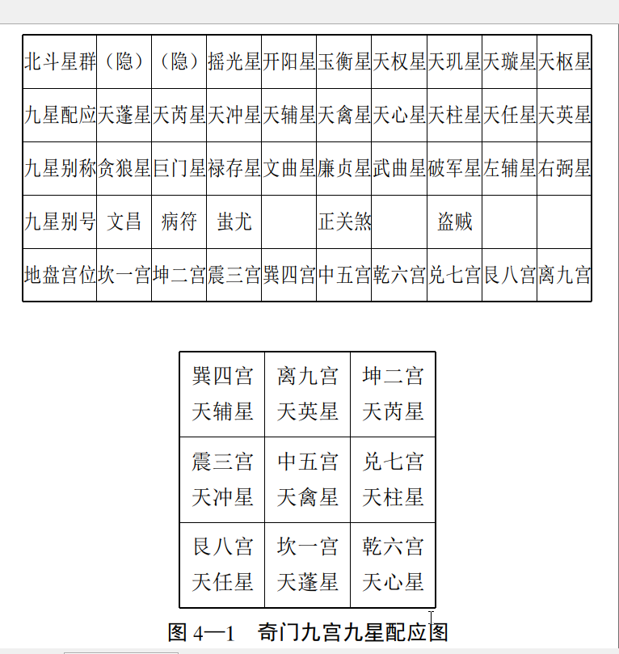
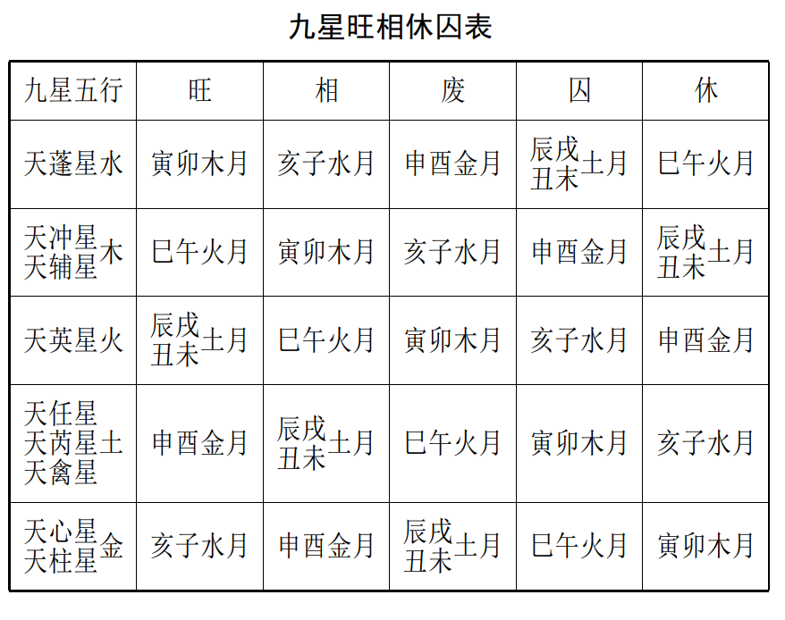
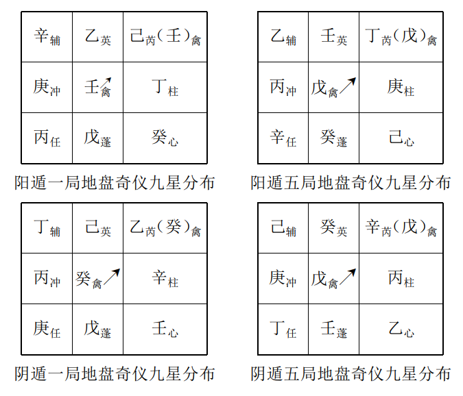
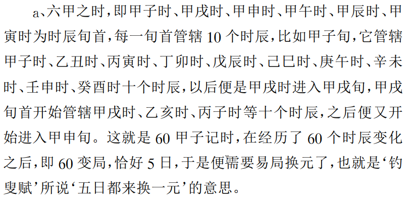
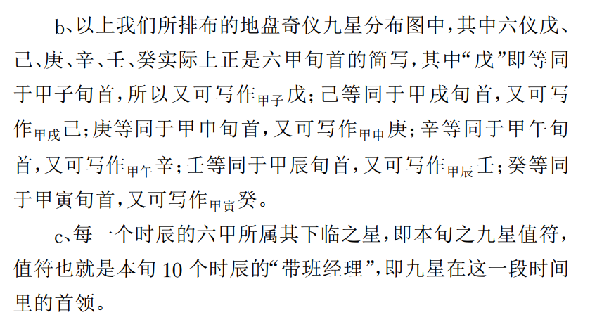
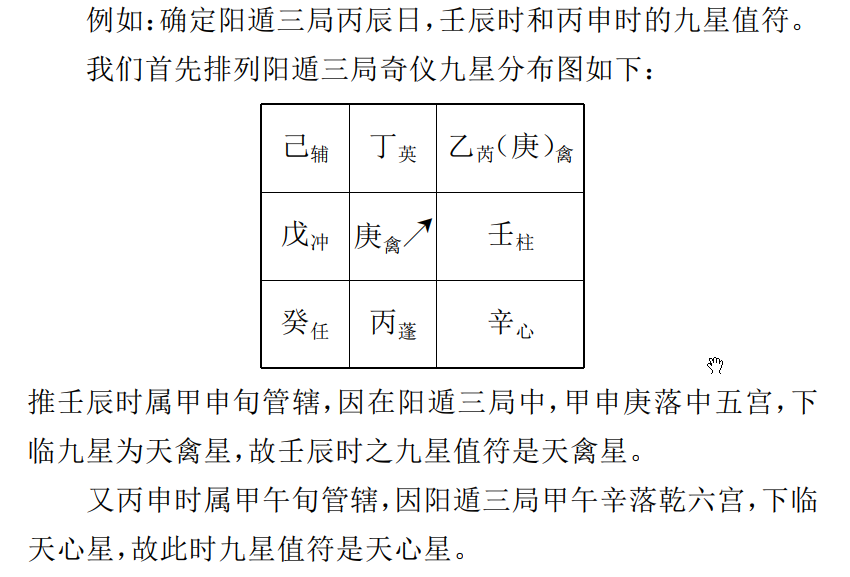
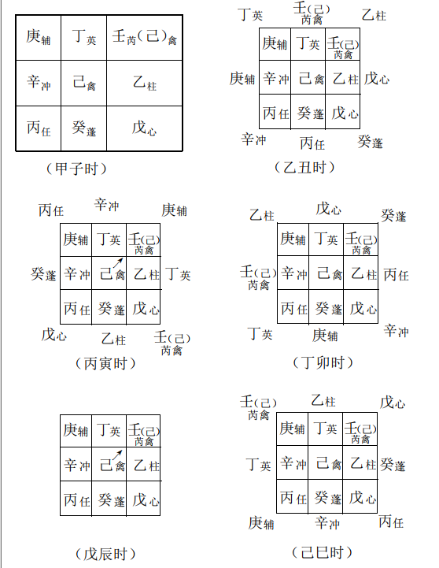
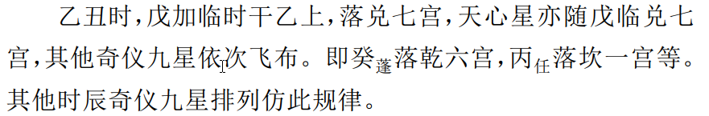

# 1.九星属性及其运行规律  

## 一、 九星概说  

九星， 实际上是北斗星群， 也就是现代天文学大熊星座的又一别称。   

北斗星群 ， 在天它运行于中央， 临制四方， 分阴阳，建四时， 均五行， 推移节气度数， 在下与朝庭王世对应， 是帝王指
示意向的象征， 决定人间纲纪， 掌管吉凶祸福。  

九星目前只能看到七星  

九星与北斗星群以及奇门地盘宫位的对应关系， 具体列表如下：  

## 二、 九星属性  

### 天蓬星

字子禽， 别号贪狼， 文昌。 属水， 阳星， 位居地盘坎一宫， 旺于冬春， 乾宫、 坎宫次旺， 其余季节和宫位衰死。 生旺时， 利安抚
边境， 修筑城池， 利文途， 得官禄， 进财喜， 艺道远扬。 衰死时， 则易遇贼盗， 破财， 酒色之灾， 淫佚、 夭亡， 流荡等恶事  

### 天芮星

字子成， 别号巨门， 病符， 五行属土， 阴星， 凶星， 位居地盘坤二宫， 旺于申、 酉和四季月， 乾兑坤宫生旺， 其余季节和宫位衰
死。 生旺时授道交友， 妇人掌权， 置田兴家， 多谋吝啬。 衰死时，损财招鬼， 阴人陷害， 脏腑疾病等。  

### 天冲星

字子翘， 别号禄存， 蚩尤， 五行属木， 阳星， 小吉， 位居地盘震三宫， 旺于春夏和震巽离三宫， 生旺时忙忙碌碌， 动中觅利。 衰
死时， 则易静不宜动， 易招惹诉讼， 官非， 车祸， 兄弟刑伤等恶事  

### 天辅星

字子卿， 别号文曲， 属木， 阳星， 大吉， 位居地盘巽四宫， 旺于春夏和震巽离三宫。 生旺之时， 文职加官， 登科甲第， 盖世文章。
衰死时， 体弱多病， 优柔寡断， 处事不利  

### 天禽星

字子公， 别号廉贞， 属土， 阳星， 吉星， 位居中五宫， 一般寄居在坤二宫， 四时皆旺， 遇天禽星值符， 入官见贵， 应举谋望， 嫁娶
移徙， 商贾营建等百事皆宜  

### 天心星

字子襄， 别号武曲， 五行属金， 阴星， 吉星， 位居地盘乾六宫，旺于秋末初冬和坤、 兑、 乾三宫。 生旺时， 升官得权， 尤利武职，
疗病合药等事亦吉， 得遇医道， 技艺超群之人。 衰死时， 官场是非， 刑妻伤子， 易患头痛、 胸痛和金属伤害等病  

### 天柱星

字子申， 别号破军， 又称盗贼星， 五行属金， 阴星， 小凶， 位居地盘兑七宫， 夏末、 秋季和坤、 兑、 乾、 坎宫生旺。 生旺时， 形藏宜  守， 屯兵自固， 宜静以制动， 退以为进， 不宜谋为进取。 衰死时，口舌诉讼， 惊恐怪异， 破坏损伤， 病患喉肺。  

### 天任星

字子韦， 别号左辅， 五行属土， 阳星， 吉星， 位居地盘艮八宫，旺于初春、 四季、 月和乾 、 兑、 艮三宫。 生旺时， 富贵功名， 置业旺产， 百事皆宜， 衰死时， 谋为阻滞， 移徙筑室凶， 病伤脾胃小口、手脚、 筋骨、 腰脊  

### 天英星

字子威， 别号右弼， 五行属火， 凶星。 位居地盘离九宫。 旺于春夏和震巽离三宫。 生旺之时， 宜饮宴作乐， 嫁娶婚姻， 文书
献策， 声名远扬。 衰死之时， 性躁易爆， 火灾回禄， 文字官司， 病患心脑血管、 眼疾。  

## 三、 九星旺衰和吉凶推断  

九星的旺衰规律  具体如下表所示。  

#### 九星旺衰之吉凶  下六句歌诀自己推断  

辅禽心星为上吉， 冲任小吉未全亨； 大凶蓬芮不堪使， 小凶英柱不精明； 大凶无气变为吉， 小凶无气一同之  

## 四、 九星运行规律  

### 1，九星配地盘奇仪  

举例如下：  

### 2、 根据时辰旬首， 确定九星值符

在六十甲子记录时辰变化的过程中， 我们首先有以下几个
规定；

#### 举例

### 3、 值符变化随时干， 其余星仪依次加临飞布。  

我们以阴遁六局甲己日的九星奇仪的变化情况具体说明如下  

甲子时， 天心星值符随甲子戊加临时干甲（ 戊）之上， 因“ 遁甲”的意思即是甲隐于戊下， 甲、 戊同看， 今甲（ 戊）加临甲（ 戊）之
上， 亦即星仪皆不做变化， 那么， 其它的奇仪九星也就随之而不 再变化， 奇门中称此种现象为“ 伏吟”。 其它如本日戊辰时， 亦作
“ 伏吟”。  

# 2，八门属性及其运行规律  

八门即开门、 休门、 生门、 伤门、 杜门、 景门、 死门、 惊门， 奇门遁甲谓之人盘， 代表人事谋为的成败与阻顺等信息， 其运行规律
随时支的变化而变化。  注意值使门和日元所临之门， 往往是人事预测和推理判断的主要依据。  

## 一、 八门属性  

### 开门

属乾， 时配戌亥， 虽为万物杀尽之时， 但乾中有亥， 纳甲壬，金动水生， 水生而育万物， 故为资生万物之初， 是谓吉门。
五行属金， 喜居乾兑之宫， 为相气， 入坎宫为旺气， 皆吉。 落艮宫入墓， 震宫为迫， 死气， 巽宫反吟， 离宫受克皆不利。
用逢开门， 开业经商， 参军考学， 加官进职， 谋为可就， 添丁进口， 乔迁婚喜， 病患痊愈， 作事欣然  

### 休门

属坎， 时配子月， 乃一阳复始之初， 草木值此而萌动， 返本还源之门， 所以是吉门。  

五行属水， 旺于震宫， 相于坎宫， 生于乾兑皆吉。 落坤、 艮被土克制， 巽宫入墓， 离宫反吟， 皆不利。
用逢休门， 灾害皆无， 财官自足， 心情舒畅， 万事合美。  

### 生门

生长发育， 生旺发达的意思， 卦配艮， 时配丑寅， 当此之时，阳气回转， 三阳俱足开泰， 万物皆生， 所以为至吉之门。
临乾兑二宫为旺， 居艮中宫为相， 生于离宫， 皆吉。 入坎宫为迫， 震宫被克， 巽宫入墓， 皆不利。
用逢生门， 求财谒贵， 谋划大业， 百事皆吉， 事业尤利房地产业、 种养殖业、 农林牧渔业。 不利埋葬治丧  

### 伤门

动遇创伤， 伤害之意， 卦配震， 时为卯月， 当此春分之时， 万物嫩甲发生， 当以吉论， 奈何物之精液自内而出， 发阳于外以致
根本泄之太过， 所谓外华而内虚， 不能胜其劳， 因此而受伤， 所以凶也。居震、 巽、 离旺相， 生于坎宫， 临兑、 乾反吟被制， 坤宫入墓，艮宫被迫， 皆凶。
用逢伤门， 宜静中求吉， 动则刑伤灾害， 求谋劳而无功， 经商、 建筑、 埋葬、 嫁娶、 上官赴任遇此亦皆不利， 出行则易遇车祸
等恶事。 但却适合捕捉渔猎、 索债、 戏耍、 赌博、 收敛财货。  

